# Docker Compose OOM & Worker Crash Diagnosis

## Summary of Observed Failures

Analysis of `docker compose logs -f` for an 8-GPU deployment of LTX2.3-Distilled FastVideo services (instances 0-7), each running on a single GPU with layerwise offloading.

### Two Distinct Failure Modes Identified

---

## Failure Mode 1: CUDA OOM on Second Request — `torch.OutOfMemoryError`

**Affected instances:** `ltx2.3-distilled-7` (and likely others under similar conditions)

### What Happened

```
Request 1 (gpu-7): 241 frames, 768x512 → SUCCESS in 47.9s
Request 2 (gpu-7): 193 frames, 768x512 → CUDA OOM during text encoding
```

### Root Cause

The OOM occurs at [`gemma.py:714`](fastvideo/models/encoders/gemma.py:714) when calling `model.to(device=get_local_torch_device())` to move the Gemma text encoder (~18GB in bf16) from CPU to GPU:

```
torch.OutOfMemoryError: CUDA out of memory. Tried to allocate 114.00 MiB.
GPU 0 has a total capacity of 31.36 GiB of which 29.19 MiB is free.
Including non-PyTorch memory, this process has 30.74 GiB memory in use.
Of the allocated memory 29.74 GiB is allocated by PyTorch,
and 351.62 MiB is reserved by PyTorch but unallocated.
```

**Key observation:** After the first request completes, **29.74 GiB remains allocated by PyTorch** on a 31.36 GiB GPU. Only 29.19 MiB is free. The GPU memory was never properly released after the first request's denoising/decoding stages.

### Why Memory Is Not Released

The layerwise offload mechanism streams transformer blocks one at a time (each ~800MB), but after the full pipeline completes:

1. **Transformer non-block params** (~855 MB) remain permanently on GPU — these are embeddings, norms, and projection layers moved during [`enable_layerwise_offload()`](fastvideo/hooks/layerwise_offload.py:190)
2. **Latent tensors and activations** from the previous request may not be fully freed if Python garbage collection hasn't run
3. **PyTorch CUDA memory allocator caching** — PyTorch reserves memory blocks for reuse. `torch.cuda.empty_cache()` is called after the upsampler offload but NOT after the full pipeline completes
4. **The spatial upsampler** (~1GB) is loaded to GPU during upsample and offloaded back, but the `torch.cuda.empty_cache()` at line 572 may not reclaim all fragmented memory
5. **VAE decode** loads the VAE to GPU for decoding and offloads it back, but again no `empty_cache()` after

The cumulative effect: after a 241-frame generation at full resolution, the GPU has ~30GB of allocated/reserved memory. When the next request tries to move Gemma (~18GB) to GPU, there is nowhere near enough space.

### Memory Timeline for the Failing Sequence

```
Request 1 (241 frames):
  Text Enc: Gemma→GPU 18GB, forward, Gemma→CPU, empty_cache
  Stage 1 half-res: transformer blocks stream through ~1.6GB peak
  Upsample: upsampler→GPU 1GB, upsample, upsampler→CPU, empty_cache
  Stage 2 full-res: transformer blocks stream through ~1.6GB peak
    + full-res activations ~8-10GB
  Audio decode: small
  VAE decode: VAE→GPU ~200MB, decode, VAE→CPU
  [NO empty_cache here]
  
  GPU state after request 1:
    - Non-block transformer params: 855MB (permanent)
    - PyTorch cached allocations: ~29GB (fragmented, not returned to CUDA)
    - Free: ~29MB

Request 2 (193 frames):
  Text Enc: Gemma→GPU... BOOM! OOM trying to allocate 114MB
```

---

## Failure Mode 2: BrokenPipeError — Worker Process Crash

**Affected instances:** `ltx2.3-distilled-3` (consistently, on both first and second requests)

### What Happened

```
Request 1 (gpu-3): 241 frames, 768x512 → BrokenPipeError
Request 2 (gpu-3): 193 frames, 768x512 → BrokenPipeError (same failure)
```

### Root Cause

The worker subprocess (spawned by `MultiprocExecutor`) crashes silently, and the parent process gets a `BrokenPipeError` when trying to send data through the multiprocessing pipe:

```python
File "fastvideo/worker/multiproc_executor.py", line 284, in collective_rpc
    worker.pipe.send({...})
BrokenPipeError: [Errno 32] Broken pipe
```

This means the worker process died before or during the forward pass. The parent never receives the worker's error because the pipe is already broken.

**Likely cause:** The worker on gpu-3 hit an OOM or other fatal error during its first real request (after warmup succeeded). The warmup uses tiny 256x256 9-frame videos, which require minimal memory. The first real request (241 frames at 768x512) requires dramatically more memory for activations, and the worker OOMs silently.

**Evidence:** Instance 3's warmup completed successfully at `00:00:46` with a 40.2s warmup. The first real request at `00:20:10` immediately fails with BrokenPipeError — the worker subprocess crashed during the forward pass, likely from an OOM that killed the child process before it could report the error back through the pipe.

### Why gpu-3 Fails But Others Succeed

Looking at the startup times, gpu-3 started at `23:58:13` — in the middle of the pack. All 8 instances are loading models concurrently from the same NFS/disk path (`/models/FastVideo/LTX2.3-Distilled-Diffusers`). The staggered startup (instances start ~1 minute apart) means:

- During gpu-3's model loading, other instances are also loading, causing **CPU memory pressure** and **disk I/O contention**
- The pinned CPU memory allocation for layerwise offload (~38GB per instance for the transformer alone) may fail or be degraded
- If pinned memory allocation fails silently, the async DMA transfers during inference will be slower or fail

With 8 instances each needing ~38GB pinned CPU RAM for the transformer + ~18GB for Gemma + overhead, the total system RAM requirement is approximately **8 × 60GB = 480GB** of pinned memory. If the system doesn't have this much RAM, some instances will fail.

---

## Successful Instances — What Worked

| Instance | GPU | Warmup | Req 1 | Req 2 | Req 3 | Notes |
|----------|-----|--------|-------|-------|-------|-------|
| 0 | gpu-0 | 38.6s ✅ | 43.2s ✅ (193f) | — | — | First to start, least contention |
| 1 | gpu-1 | 39.6s ✅ | 47.9s ✅ (241f) | — | — | |
| 2 | gpu-2 | 40.2s ✅ | 43.8s ✅ (193f) | — | — | |
| 3 | gpu-3 | 40.4s ✅ | ❌ BrokenPipe | ❌ BrokenPipe | — | Worker crash |
| 4 | gpu-4 | 52.2s ✅ | 90.6s ✅ (241f) | 35.5s ✅ (241f) | 41.3s ✅ (193f) | Handled 3 requests! |
| 5 | gpu-5 | 54.5s ✅ | — | — | — | No requests shown |
| 6 | gpu-6 | 54.8s ✅ | — | — | — | No requests shown |
| 7 | gpu-7 | 98.8s ✅ | 47.9s ✅ (241f) | ❌ OOM | — | OOM on 2nd request |

**Key observations:**
- Instance 4 successfully handled 3 requests including back-to-back 241-frame generations
- Instance 7 succeeded on first request but OOMed on second
- Instance 3 never succeeded on any real request

---

## Recommended Fixes

### Fix 1: Add `torch.cuda.empty_cache()` After Each Request Completes

**Priority: HIGH — Fixes the OOM on second request**

The most critical missing piece is a `torch.cuda.empty_cache()` call after the full pipeline forward pass completes. Currently, `empty_cache()` is only called after the upsampler offload (line 572 of [`ltx2_distilled_denoising.py`](fastvideo/pipelines/stages/ltx2_distilled_denoising.py:572)), but NOT after:
- VAE decoding completes
- Audio decoding completes  
- The full request finishes

**Where to add it:**

1. In [`video_generator.py`](fastvideo/entrypoints/video_generator.py) after `execute_forward` returns — this is the top-level entry point that wraps the full pipeline
2. In the pipeline's post-forward cleanup

```python
# After the full pipeline forward completes:
torch.cuda.empty_cache()
gc.collect()
```

This should free the ~29GB of cached PyTorch allocations, leaving only the permanent non-block params (~855MB) on GPU, giving plenty of room for the next request's Gemma load.

### Fix 2: Add OOM Recovery with Retry in the Worker

**Priority: MEDIUM — Makes the service resilient**

When a worker hits OOM, it should:
1. Catch `torch.OutOfMemoryError`
2. Call `torch.cuda.empty_cache()` and `gc.collect()`
3. Retry the forward pass once
4. If it fails again, return a proper error instead of crashing

In [`gpu_worker.py:80`](fastvideo/worker/gpu_worker.py:80):

```python
def execute_forward(self, forward_batch, fastvideo_args):
    try:
        output_batch = self.pipeline.forward(forward_batch, fastvideo_args)
    except torch.cuda.OutOfMemoryError:
        logger.warning("OOM during forward pass, clearing cache and retrying...")
        torch.cuda.empty_cache()
        gc.collect()
        output_batch = self.pipeline.forward(forward_batch, fastvideo_args)
    return output_batch
```

### Fix 3: Explicit `torch.cuda.empty_cache()` After Gemma Offload in `gemma.py`

**Priority: HIGH — Ensures Gemma's 18GB is fully freed**

In [`gemma.py:738`](fastvideo/models/encoders/gemma.py:738), after `model.to(device="cpu")`, add:

```python
model.to(device="cpu")
torch.cuda.empty_cache()  # Ensure the 18GB is returned to CUDA
```

### Fix 4: Add `torch.cuda.empty_cache()` After VAE Decode Offload

**Priority: MEDIUM**

In the VAE decoding stage, after the VAE is offloaded back to CPU, add `torch.cuda.empty_cache()`.

### Fix 5: Monitor and Log GPU Memory at Key Points

**Priority: LOW — Debugging aid**

Add memory logging at key pipeline transitions:

```python
def log_gpu_memory(label: str):
    allocated = torch.cuda.memory_allocated() / 1024**3
    reserved = torch.cuda.memory_reserved() / 1024**3
    logger.info("[GPU Memory] %s: allocated=%.2fGB, reserved=%.2fGB", 
                label, allocated, reserved)
```

Call at: after text encoding, before/after each denoising stage, after upsample, after decode, after request completion.

### Fix 6: Investigate Worker Crash on gpu-3

**Priority: MEDIUM**

The BrokenPipeError on gpu-3 suggests the worker subprocess is crashing without reporting the error. This could be:

1. **OOM kill by the OS** — Check `dmesg` or `/var/log/kern.log` for OOM killer messages
2. **Insufficient system RAM for pinned memory** — 8 instances × ~60GB pinned = 480GB needed
3. **CUDA error during model loading** — The worker may have loaded with corrupted state

**Diagnostic steps:**
- Check system RAM: `free -h` — need at least 500GB for 8 instances
- Check dmesg: `dmesg | grep -i "oom\|killed"` 
- Add try/except around the worker's forward pass to catch and log all exceptions before the pipe breaks

---

## Architecture Diagram: Memory Flow Per Request

```mermaid
flowchart TD
    subgraph Request Lifecycle
        A[Request arrives] --> B[Text Encoding]
        B --> C[Latent Preparation]
        C --> D[Denoising Stage 1 - half res]
        D --> E[Spatial Upsample]
        E --> F[Denoising Stage 2 - full res]
        F --> G[Audio Decoding]
        G --> H[VAE Decoding]
        H --> I[Return video]
    end

    subgraph GPU Memory - Current
        B1[Gemma 18GB → GPU] --> B2[Forward] --> B3[Gemma → CPU]
        D1[Blocks stream 1.6GB peak] --> D2[Activations small]
        E1[Upsampler 1GB → GPU] --> E2[Upsample] --> E3[Upsampler → CPU + empty_cache]
        F1[Blocks stream 1.6GB peak] --> F2[Activations 8-10GB]
        H1[VAE 200MB → GPU] --> H2[Decode] --> H3[VAE → CPU]
        H3 --> I1[NO empty_cache! 29GB cached]
    end

    subgraph GPU Memory - Fixed
        B1F[Gemma 18GB → GPU] --> B2F[Forward] --> B3F[Gemma → CPU + empty_cache]
        D1F[Blocks stream 1.6GB peak] --> D2F[Activations small]
        E1F[Upsampler 1GB → GPU] --> E2F[Upsample] --> E3F[Upsampler → CPU + empty_cache]
        F1F[Blocks stream 1.6GB peak] --> F2F[Activations 8-10GB]
        H1F[VAE 200MB → GPU] --> H2F[Decode] --> H3F[VAE → CPU + empty_cache]
        H3F --> I1F[~855MB cached - ready for next request]
    end
```



## Will This Break Layerwise Offload or the Fast CUDA Cache?

**Short answer: No.** Here is why each proposed fix is safe:

### Layerwise Offload Compatibility

The layerwise offload system in [`layerwise_offload.py`](fastvideo/hooks/layerwise_offload.py) manages its own memory lifecycle:

1. **CPU-side pinned tensors** are stored in `state.cpu_named_parameters` — these live in CPU pinned RAM and are never affected by `torch.cuda.empty_cache()`
2. **GPU-side tensors** are created fresh each time via `cpu_tensor.to(device, non_blocking=True)` in [`prefetch_params()`](fastvideo/hooks/layerwise_offload.py:59) and deleted via `del self.gpu_named_parameters[name]` in [`release_gpu_params()`](fastvideo/hooks/layerwise_offload.py:74)
3. **The circular prefetch chain** (block N+1 prefetched during block N compute) operates within a single forward pass — all `empty_cache()` calls happen **between requests**, not during a forward pass

The proposed `empty_cache()` calls are placed at:
- After Gemma offload to CPU (between text encoding and denoising — no transformer blocks on GPU)
- After VAE offload to CPU (after decoding — no transformer blocks on GPU)
- After the full pipeline completes (between requests — no transformer blocks on GPU)

**None of these overlap with the layerwise offload's prefetch/compute cycle.** During denoising, the layerwise hooks manage their own GPU allocations and releases. The `empty_cache()` calls only run when the transformer is idle.

### PyTorch CUDA Caching Allocator Compatibility

`torch.cuda.empty_cache()` does NOT free actively-used GPU tensors. It only returns **unused cached blocks** back to the CUDA driver. Specifically:

- Tensors that are still referenced by Python variables are **not freed**
- The non-block transformer params (~855MB permanently on GPU) are referenced by the model's parameter tensors — they stay
- The pinned CPU tensors used by layerwise offload are on CPU — unaffected
- The `record_stream()` calls in [`prefetch_params()`](fastvideo/hooks/layerwise_offload.py:69) ensure async-copied tensors aren't freed prematurely

**The only effect of `empty_cache()` between requests** is returning the large temporary allocations (activations, intermediate latents, Gemma's 18GB footprint after offload) back to the CUDA driver. This is exactly what we want — it makes room for the next request's Gemma load.

### Performance Impact

`torch.cuda.empty_cache()` has a small cost (~1-5ms) because it synchronizes the CUDA allocator. This is negligible compared to the 35-50s per request. The next request's allocations will be slightly slower (first allocation from CUDA driver instead of cache), but this is a one-time cost per allocation size class and is dwarfed by the CPU→GPU transfer times.

**The alternative — not calling `empty_cache()` — causes OOM on the second request**, which is far worse than a few milliseconds of allocator overhead.

### What About Instance 4 That Handled 3 Requests Successfully?

Instance 4 (gpu-4) successfully handled 3 requests without any `empty_cache()` fix. Looking at the timing:

- Request 1: 241 frames, 90.6s (slow — likely memory pressure)
- Request 2: 241 frames, 35.5s (fast — pipeline warm)
- Request 3: 193 frames, 41.3s (fast)

Instance 4 may have succeeded because:
1. Its requests were spaced further apart, giving Python GC time to collect intermediate tensors
2. The 241→241→193 frame sequence may have reused cached allocations of the same size
3. Random variation in CUDA memory fragmentation

This is not reliable — the OOM on gpu-7 proves the current approach is fragile.

---

## Files to Modify

| File | Change | Priority |
|------|--------|----------|
| [`fastvideo/models/encoders/gemma.py`](fastvideo/models/encoders/gemma.py:738) | Add `torch.cuda.empty_cache()` after Gemma CPU offload | HIGH |
| [`fastvideo/entrypoints/video_generator.py`](fastvideo/entrypoints/video_generator.py) | Add `torch.cuda.empty_cache()` + `gc.collect()` after full pipeline completes | HIGH |
| [`fastvideo/worker/gpu_worker.py`](fastvideo/worker/gpu_worker.py:80) | Add OOM catch-and-retry logic | MEDIUM |
| [`fastvideo/pipelines/stages/decoding.py`](fastvideo/pipelines/stages/decoding.py) | Add `torch.cuda.empty_cache()` after VAE offload | MEDIUM |
| [`fastvideo/pipelines/stages/ltx2_distilled_denoising.py`](fastvideo/pipelines/stages/ltx2_distilled_denoising.py) | Add GPU memory logging at stage transitions | LOW |

## Expected Impact

| Metric | Before Fix | After Fix |
|--------|-----------|-----------|
| Second request OOM rate | ~50% (gpu-7 pattern) | ~0% |
| Worker crash rate | ~12.5% (gpu-3 pattern) | Reduced with OOM recovery |
| GPU memory after request | ~29GB cached | ~855MB cached |
| Time between requests | N/A (OOM) | ~2-3s (cache clear overhead) |
