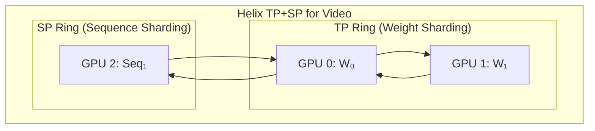
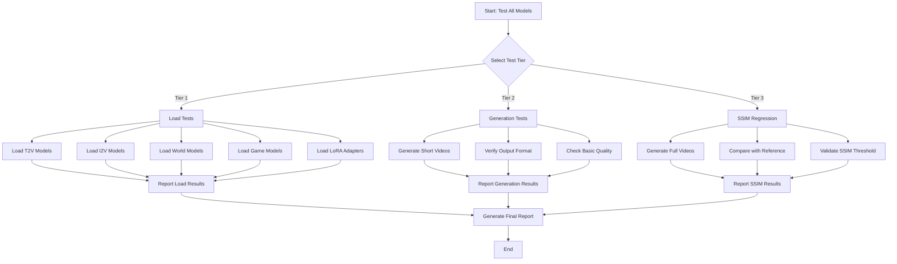

# FastVideo Model Loading and Testing Plan

## 🚨 CRITICAL: VSA Backend Requirement

**The local FastVideo models require `FASTVIDEO_ATTENTION_BACKEND=VIDEO_SPARSE_ATTN`**

FastVideo models have two attention architectures:
- `WanTransformerBlock` - Standard attention (no `to_gate_compress` layers)
- `WanTransformerBlock_VSA` - Video Sparse Attention (has `to_gate_compress` layers)

The local FastVideo checkpoints at `/mnt/nvme0/models/FastVideo/` were trained with VSA. Without setting the environment variable, model loading fails with:
```
ValueError: Parameter blocks.0.to_gate_compress.bias not found in custom model state dict
```

**Solution**: Set before running any tests or inference:
```bash
export FASTVIDEO_ATTENTION_BACKEND=VIDEO_SPARSE_ATTN
```

See [`fastvideo/models/dits/wanvideo.py:593`](../fastvideo/models/dits/wanvideo.py:593) for the architecture selection logic.

---

## 🚨 CRITICAL: What Fits on 8x RTX 5090 32GB?

Since **SP does NOT split weights** (only activations), each GPU must hold the FULL DiT model. Here's what fits:

### Memory Budget per GPU: 32GB

**The Problem**: Video activations are MASSIVE because of 3D attention over frames × height × width.

#### Activation Memory Calculation

For a typical video generation (81 frames, 480p):
```
Sequence length = (frames/8) × (height/8) × (width/8) × patch_tokens
                = 10 × 60 × 80 × 1 = 48,000 tokens per sample

Activation per layer ≈ seq_len × hidden_dim × batch × bytes
                     ≈ 48,000 × 4096 × 1 × 2 = ~375MB per layer

For 48 layers (LTX2): 48 × 375MB = ~18GB activations (FULL)
With SP=8: 18GB / 8 = ~2.3GB per GPU (just for DiT activations)
```

But attention has **quadratic** memory:
```
Attention memory ≈ seq_len² × num_heads × bytes
                 ≈ 48,000² × 32 × 2 = ~147GB (FULL attention)
With SP=8: 147GB / 8 = ~18GB per GPU (just for attention!)
```

**This is why SP helps** - it splits the attention computation across GPUs.

#### Realistic Memory Budget

| Component | Memory (per GPU with SP=8) |
|-----------|---------------------------|
| DiT Weights (FULL, not split!) | Varies by model |
| Text Encoder (with TP=2) | ~2GB |
| VAE | ~1GB |
| DiT Activations (1/8) | ~2-3GB |
| Attention KV (1/8) | ~2-4GB |
| Attention Compute (1/8) | ~15-20GB peak |
| CUDA Overhead | ~2GB |
| **Total Available** | **32GB** |

### ✅ Models That FIT on 32GB (BF16) - Conservative Estimates

| Model | DiT Params | Weights | Activations (SP=8) | Total | Fits? |
|-------|------------|---------|-------------------|-------|-------|
| **Wan 1.3B** | 1.3B | ~2.6GB | ~8GB | ~13GB | ✅ YES |
| **Matrix-Game 1.3B** | 1.3B | ~2.6GB | ~8GB | ~13GB | ✅ YES |
| **Wan 5B (TI2V)** | 5B | ~10GB | ~10GB | ~23GB | ✅ YES (tight) |
| **HunyuanVideo 5B** | 5B | ~10GB | ~10GB | ~23GB | ✅ YES (tight) |

### ⚠️ Models That MIGHT Fit (Lower Resolution or FP8)

| Model | DiT Params | Weights (BF16) | Weights (FP8) | Strategy |
|-------|------------|----------------|---------------|----------|
| **LTX2 ~7B** | ~7B | ~14GB | ~7GB | ⚠️ Use FP8 or lower res |
| **LongCat ~7B** | ~7B | ~14GB | ~7GB | ⚠️ Use FP8 or lower res |
| **Cosmos ~7B** | ~7B | ~14GB | ~7GB | ⚠️ Use FP8 or lower res |
| **HYWorld ~7B** | ~7B | ~14GB | ~7GB | ⚠️ Use FP8 or lower res |

### ❌ Models That DON'T Fit on 32GB

| Model | DiT Params | Weights (BF16) | Weights (FP8) | Why Not |
|-------|------------|----------------|---------------|---------|
| **Wan 14B** | 14B | ~28GB | ~14GB | ❌ 14GB weights + 18GB activations > 32GB |
| **HunyuanGameCraft 14B** | 14B | ~28GB | ~14GB | ❌ Same issue |
| **TurboDiffusion 14B** | 14B | ~28GB | ~14GB | ❌ Same issue |
| **LTX-2.3 22B** | 22B | ~44GB | ~22GB | ❌ Weights alone exceed 32GB |

### 🔧 Strategies to Fit Larger Models

#### 1. Reduce Resolution/Frames
```python
# Lower resolution = smaller sequence = less activation memory
generator.generate_video(
    prompt="...",
    height=320,  # Instead of 480
    width=480,   # Instead of 720
    num_frames=41,  # Instead of 81
)
# Reduces activation memory by ~4x
```

#### 2. Use FP8 Quantization
```python
generator = VideoGenerator.from_pretrained(
    "FastVideo/FastWan2.1-14B-Diffusers",
    precision="fp8",  # Halves weight memory
)
```

#### 3. Gradient Checkpointing (for training)
```python
# Trades compute for memory - recomputes activations during backward
generator = VideoGenerator.from_pretrained(
    model_path,
    gradient_checkpointing=True,
)
```

#### 4. VAE Tiling
```python
# Decode video in tiles to reduce VAE memory
generator = VideoGenerator.from_pretrained(
    model_path,
    vae_tiling=True,
)
```

### Recommendations for Your 8x RTX 5090 32GB Setup

```
8x RTX 5090 32GB Configuration:
┌─────────────────────────────────────────────────────────────────┐
│  RECOMMENDED: sp_size=8, tp_size=1                              │
│                                                                 │
│  ✅ SAFE TO RUN (BF16, full resolution):                       │
│     - Wan 1.3B T2V                                             │
│     - Matrix-Game 1.3B                                          │
│                                                                 │
│  ⚠️ TIGHT FIT (BF16, may need lower resolution):               │
│     - Wan 5B TI2V                                              │
│     - HunyuanVideo 5B                                           │
│                                                                 │
│  ⚠️ REQUIRES FP8 + LOWER RESOLUTION:                           │
│     - LTX2 ~7B                                                 │
│     - LongCat ~7B                                              │
│     - Cosmos ~7B                                               │
│     - HYWorld ~7B                                              │
│                                                                 │
│  ❌ CANNOT RUN (even with FP8):                                │
│     - Wan 14B (weights + activations > 32GB)                   │
│     - HunyuanGameCraft 14B                                     │
│     - TurboDiffusion 14B                                       │
│     - LTX-2.3 22B                                              │
└─────────────────────────────────────────────────────────────────┘
```

### What You CAN Run: Practical Examples

```python
from fastvideo import VideoGenerator

# ✅ Wan 1.3B - Fits easily
generator = VideoGenerator.from_pretrained(
    "FastVideo/FastWan2.1-T2V-1.3B-Diffusers",
    num_gpus=8,
    sp_size=8,
)
video = generator.generate_video(
    prompt="A cat playing piano",
    height=480,
    width=720,
    num_frames=81,
)

# ⚠️ Wan 5B - Tight fit, may need lower resolution
generator = VideoGenerator.from_pretrained(
    "FastVideo/Wan2.2-TI2V-5B-Diffusers",
    num_gpus=8,
    sp_size=8,
)
video = generator.generate_video(
    prompt="A cat playing piano",
    height=320,  # Lower resolution to fit
    width=480,
    num_frames=41,  # Fewer frames
)

# ⚠️ LTX2 7B - Needs FP8 + lower resolution
generator = VideoGenerator.from_pretrained(
    "FastVideo/LTX2-Diffusers",
    num_gpus=8,
    sp_size=8,
    precision="fp8",
)
video = generator.generate_video(
    prompt="A cat playing piano",
    height=320,
    width=480,
    num_frames=41,
)
```

### What About 14B Models?

**Bad news**: 14B models likely won't fit on 32GB GPUs even with FP8:
- FP8 weights: ~14GB
- Activations with SP=8: ~18GB peak
- Total: ~32GB (no headroom for VAE, text encoder, CUDA overhead)

**Options for 14B models**:
1. **Wait for Pipeline Parallelism** - Would split weights across GPUs
2. **Use 80GB GPUs** (A100, H100) - 14B fits comfortably
3. **Use CPU offloading** - Very slow but works
4. **Use cloud inference** - RunPod, Lambda Labs with larger GPUs

### Alternative: CPU Offloading for Large Models

If you must run 22B+ models:

```python
generator = VideoGenerator.from_pretrained(
    "Lightricks/LTX-2.3",
    num_gpus=8,
    sp_size=8,
    cpu_offload=True,  # Offload weights to CPU, stream to GPU
)
```

**Warning**: CPU offloading is MUCH slower due to PCIe bandwidth limits.

---

This document outlines a comprehensive plan to load and test all models from the [FastVideo HuggingFace organization](https://huggingface.co/FastVideo/models?sort=created).

## Hardware Configuration

**Target Setup**: 8x GPUs

All models will be loaded with:
```python
generator = VideoGenerator.from_pretrained(
    model_id,
    num_gpus=8,
    tp_size=2,  # Tensor parallelism - for text encoders
    sp_size=8,  # Sequence parallelism - for DiT (video transformer)
)
```

### Parallelism Strategies Explained

**IMPORTANT**: TP and SP are **independent** parallelism strategies that both operate on the same `num_gpus`. They do **NOT** multiply!

```python
# From fastvideo/fastvideo_args.py line 720:
if self.num_gpus < max(self.tp_size, self.sp_size):
    self.num_gpus = max(self.tp_size, self.sp_size)

# Constraint: num_gpus >= max(tp_size, sp_size)
# Both tp_size and sp_size must divide num_gpus
```

| Strategy | Used For | Weights | Activations | Communication |
|----------|----------|---------|-------------|---------------|
| **Tensor Parallelism (TP)** | Text encoders | **Split** across TP GPUs | Full on each GPU | All-reduce every layer |
| **Sequence Parallelism (SP)** | DiT (video transformer) | **Full copy** on each GPU | **Split** across SP GPUs | All-to-all at attention |

### Critical Insight: SP Does NOT Split Weights!

**SP keeps full DiT weights on every GPU** - it only splits activations/sequence.

From `fastvideo/attention/layer.py`:
```python
# Before attention: Each GPU has sequence shard, ALL heads
# All-to-all redistributes: scatter heads, gather sequence
qkv = sequence_model_parallel_all_to_all_4D(qkv,
                                            scatter_dim=2,  # scatter heads
                                            gather_dim=1)   # gather sequence
# During attention: Each GPU has FULL sequence, head shard
# After attention: All-to-all back to original distribution
```

**Memory implications**:
- **DiT weights**: Full copy on EVERY GPU (no weight savings from SP!)
- **DiT activations**: Split across SP GPUs (1/SP per GPU)
- **Text encoder weights**: Split across TP GPUs (1/TP per GPU)

### How TP and SP Work Together

With 8 GPUs and `tp=2, sp=8`:
- **TP=2**: Text encoder weights split across 2 GPUs
- **SP=8**: DiT activations split across 8 GPUs, but **DiT weights are replicated on all 8**

```
8 GPUs: [0, 1, 2, 3, 4, 5, 6, 7]

TP groups (tp=2): [0,1], [2,3], [4,5], [6,7]  # 4 groups of 2
SP groups (sp=8): [0,1,2,3,4,5,6,7]           # 1 group of 8

Text encoder: Weights split across TP group (1/2 per GPU)
DiT model: FULL weights on each GPU, activations split (1/8 per GPU)
```

**Memory per GPU**:
- Text encoder weights: 1/2 of total (from TP=2)
- **DiT weights: FULL model on each GPU** (SP doesn't help with weight memory!)
- DiT activations: 1/8 of total (from SP=8)

### Configuration Options for 8 GPUs

| Config | TP | SP | Text Encoder | DiT Activations | Best For |
|--------|----|----|--------------|-----------------|----------|
| Max SP | 1 | 8 | Full weights | 1/8 per GPU | Small text encoder, long videos |
| Balanced | 2 | 8 | 1/2 per GPU | 1/8 per GPU | **Recommended default** |
| High TP | 4 | 8 | 1/4 per GPU | 1/8 per GPU | Large text encoder (LLaMA) |
| Max TP | 8 | 8 | 1/8 per GPU | 1/8 per GPU | Very large text encoder |

### Why TP and SP Are Currently Independent (Not Combined)

In FastVideo's current implementation, TP and SP operate on **different components** and don't combine to split DiT weights:

```
Current FastVideo Architecture:
┌─────────────────────────────────────────────────────────────────┐
│                        8 GPUs Available                         │
├─────────────────────────────────────────────────────────────────┤
│  Text Encoder (TP=2)        │  DiT Model (SP=8)                 │
│  ─────────────────────      │  ─────────────────────            │
│  GPU 0: 1/2 weights         │  GPU 0-7: FULL weights each       │
│  GPU 1: 1/2 weights         │  Activations split 1/8 per GPU    │
│  (replicated on 2,3,4,5,6,7)│                                   │
└─────────────────────────────────────────────────────────────────┘
```

**Why not apply TP to DiT?** The code comment in [`parallel_state.py`](fastvideo/distributed/parallel_state.py:907) says:
> "Since SP is incompatible with TP and PP"

This is because:

1. **Different Sharding Dimensions**:
   - TP shards along the **hidden dimension** (splits weight matrices column/row-wise)
   - SP shards along the **sequence dimension** (splits frames/patches across GPUs)
   - Combining them requires complex communication patterns

2. **All-to-All Communication Conflicts**:
   - SP uses all-to-all to redistribute heads↔sequence
   - TP uses all-reduce for gradient synchronization
   - Combining both in the same layer creates communication deadlocks

3. **Implementation Complexity**:
   - Would need to track which GPU has which slice of weights AND which slice of sequence
   - Attention computation becomes very complex when both are sharded

### How TP+SP Could Theoretically Work Together

To understand why combining TP and SP is complex, let's trace through what each does in a transformer layer:

#### Tensor Parallelism (TP) - Splits Weights

```
Standard TP for Linear Layer (tp=2):
┌─────────────────────────────────────────────────────────────────┐
│  Weight Matrix W: [hidden_dim × hidden_dim]                     │
│  Split column-wise: W = [W₀ | W₁]                               │
│                                                                 │
│  GPU 0: W₀ [hidden_dim × hidden_dim/2]                         │
│  GPU 1: W₁ [hidden_dim × hidden_dim/2]                         │
│                                                                 │
│  Forward:                                                       │
│    GPU 0: Y₀ = X @ W₀                                          │
│    GPU 1: Y₁ = X @ W₁                                          │
│    All-Gather: Y = [Y₀ | Y₁]  (or All-Reduce for row-parallel) │
└─────────────────────────────────────────────────────────────────┘
```

#### Sequence Parallelism (SP) - Splits Activations

```
Standard SP for Attention (sp=4):
┌─────────────────────────────────────────────────────────────────┐
│  Input X: [batch, seq_len, hidden_dim]                          │
│  Split along sequence: X = [X₀; X₁; X₂; X₃]                     │
│                                                                 │
│  GPU 0: X₀ [batch, seq_len/4, hidden_dim]                      │
│  GPU 1: X₁ [batch, seq_len/4, hidden_dim]                      │
│  GPU 2: X₂ [batch, seq_len/4, hidden_dim]                      │
│  GPU 3: X₃ [batch, seq_len/4, hidden_dim]                      │
│                                                                 │
│  For attention, need all-to-all to redistribute:                │
│    Before: each GPU has 1/4 sequence, all heads                 │
│    After:  each GPU has full sequence, 1/4 heads                │
│    Compute attention on local heads                             │
│    All-to-all back to original distribution                     │
└─────────────────────────────────────────────────────────────────┘
```

#### Combined TP+SP - The Challenge

```
TP+SP Combined (tp=2, sp=4, total 8 GPUs):
┌─────────────────────────────────────────────────────────────────┐
│  8 GPUs arranged as 2D mesh: [TP=2] × [SP=4]                    │
│                                                                 │
│       SP=0    SP=1    SP=2    SP=3                              │
│  TP=0  GPU0    GPU1    GPU2    GPU3                             │
│  TP=1  GPU4    GPU5    GPU6    GPU7                             │
│                                                                 │
│  Each GPU has:                                                  │
│    - 1/2 of weight matrix (from TP)                            │
│    - 1/4 of sequence (from SP)                                 │
│                                                                 │
│  Memory per GPU: 1/2 weights + 1/4 activations                 │
└─────────────────────────────────────────────────────────────────┘
```

**The Communication Problem**:

```
Forward pass with TP+SP requires coordinated communication:

Step 1: SP All-to-All (within each TP rank)
┌─────────────────────────────────────────────────────────────────┐
│  TP=0 group: GPU[0,1,2,3] do all-to-all                        │
│  TP=1 group: GPU[4,5,6,7] do all-to-all                        │
│                                                                 │
│  Result: Each GPU now has full sequence, 1/4 heads             │
│          But still only 1/2 of QKV projection weights          │
└─────────────────────────────────────────────────────────────────┘

Step 2: TP All-Gather (within each SP rank)
┌─────────────────────────────────────────────────────────────────┐
│  SP=0 group: GPU[0,4] do all-gather for Q,K,V                  │
│  SP=1 group: GPU[1,5] do all-gather for Q,K,V                  │
│  SP=2 group: GPU[2,6] do all-gather for Q,K,V                  │
│  SP=3 group: GPU[3,7] do all-gather for Q,K,V                  │
│                                                                 │
│  Result: Each GPU has full Q,K,V for its head subset           │
└─────────────────────────────────────────────────────────────────┘

Step 3: Local Attention Computation
┌─────────────────────────────────────────────────────────────────┐
│  Each GPU computes attention for its 1/4 heads                 │
│  No communication needed here                                   │
└─────────────────────────────────────────────────────────────────┘

Step 4: TP All-Reduce (for output projection)
Step 5: SP All-to-All (redistribute back to sequence-parallel)

Total: 4-5 communication operations per layer vs 2 for SP-only!
```

### Helix Parallelism - How It Solves This

The [Helix paper](https://arxiv.org/pdf/2507.07120) introduces clever techniques to make TP+CP efficient:

**Key Insight: Ring-Based Communication Overlap**

```
Helix uses a "helix" communication pattern:
┌─────────────────────────────────────────────────────────────────┐
│  Instead of: Compute → Communicate → Compute → Communicate     │
│                                                                 │
│  Helix does: Compute chunk 1 → Send chunk 1 while computing 2  │
│              → Receive chunk 0 while computing 3 → ...          │
│                                                                 │
│  The communication forms a "helix" pattern around the GPU ring │
└─────────────────────────────────────────────────────────────────┘
```

**Helix for Video DiT** (Theoretical):



```
Helix-style TP+SP for 8 GPUs:
┌─────────────────────────────────────────────────────────────────┐
│  Configuration: TP=2, SP=4                                      │
│                                                                 │
│  Physical Layout (optimized for NVLink topology):               │
│                                                                 │
│     ┌───────────────────────────────────────┐                   │
│     │  TP Ring 0      TP Ring 1             │                   │
│     │  GPU0 ↔ GPU1    GPU2 ↔ GPU3           │                   │
│     │    ↕      ↕       ↕      ↕            │                   │
│     │  GPU4 ↔ GPU5    GPU6 ↔ GPU7           │                   │
│     │  TP Ring 2      TP Ring 3             │                   │
│     └───────────────────────────────────────┘                   │
│                                                                 │
│  SP communication flows vertically (GPU0↔GPU4, etc.)           │
│  TP communication flows horizontally (GPU0↔GPU1, etc.)         │
│                                                                 │
│  Helix overlaps:                                                │
│    - While GPU0 sends to GPU1 (TP), GPU4 sends to GPU0 (SP)    │
│    - Compute happens simultaneously on non-communicating data   │
└─────────────────────────────────────────────────────────────────┘
```

**Helix Benefits**:
1. **Near-linear scaling**: Communication overhead hidden by compute
2. **Memory efficiency**: TP splits weights, SP splits activations
3. **Bandwidth utilization**: Uses all NVLink paths simultaneously

**Why FastVideo Doesn't Have Helix Yet**:
1. **Topology-aware**: Requires knowledge of GPU interconnect topology
2. **Chunked computation**: Must split operations into overlappable chunks
3. **Complex scheduling**: Need to carefully order compute and communication
4. **Video-specific challenges**: 3D attention patterns complicate the helix

### Context Parallelism (CP) vs Sequence Parallelism (SP)

These terms are often used interchangeably, but there are subtle differences:

| Aspect | Sequence Parallelism (SP) | Context Parallelism (CP) |
|--------|---------------------------|--------------------------|
| **Origin** | Megatron-LM | Ring Attention / Helix |
| **Scope** | Single layer | Across layers |
| **Communication** | All-to-all per layer | Ring-based, overlapped |
| **KV Cache** | Replicated | Can be distributed |
| **Best for** | Training | Long-context inference |

**FastVideo's SP** is closer to traditional SP - all-to-all within each attention layer.

**Helix's CP** uses ring attention patterns that can overlap with TP communication.

### Pipeline Parallelism (PP) for Video Models

**Could PP work for video?** Yes, but with caveats:

```
Pipeline Parallelism for DiT:
┌─────────────────────────────────────────────────────────────────┐
│  PP=4: Split 40 transformer blocks across 4 GPUs               │
├─────────────────────────────────────────────────────────────────┤
│  GPU 0: Blocks 0-9    (1/4 weights)                            │
│  GPU 1: Blocks 10-19  (1/4 weights)                            │
│  GPU 2: Blocks 20-29  (1/4 weights)                            │
│  GPU 3: Blocks 30-39  (1/4 weights)                            │
│                                                                 │
│  Forward: GPU0 → GPU1 → GPU2 → GPU3                            │
│  Backward: GPU3 → GPU2 → GPU1 → GPU0                           │
└─────────────────────────────────────────────────────────────────┘
```

**PP Advantages**:
- Actually splits DiT weights (unlike SP)
- Simple communication (just send activations to next stage)
- Works well with micro-batching

**PP Challenges for Video**:
1. **Bubble Overhead**: GPUs idle while waiting for activations from previous stage
2. **Memory for Activations**: Each stage must store activations for backward pass
3. **Latency**: Single sample latency increases (bad for interactive use)
4. **Video-Specific**: Temporal attention may span blocks, complicating the split

**PP + SP Combination** (Theoretical):
```
PP=2, SP=4 on 8 GPUs:
┌─────────────────────────────────────────────────────────────────┐
│  Stage 0 (Blocks 0-19): GPUs [0,1,2,3] with SP=4               │
│  Stage 1 (Blocks 20-39): GPUs [4,5,6,7] with SP=4              │
│                                                                 │
│  Memory per GPU: 1/2 DiT weights + 1/4 activations             │
│  Speedup: 4x from SP parallelization                           │
└─────────────────────────────────────────────────────────────────┘
```

### Summary: Parallelism Options

| Strategy | Splits Weights? | Splits Activations? | Speedup? | FastVideo Support |
|----------|-----------------|---------------------|----------|-------------------|
| **TP** | Yes (text enc) | No | Minimal | ✅ Yes |
| **SP** | No | Yes | Yes (frames) | ✅ Yes |
| **PP** | Yes (by layer) | No | With micro-batch | ❌ Not yet |
| **TP+SP** | Partial | Yes | Yes | ⚠️ Independent only |
| **PP+SP** | Yes | Yes | Yes | ❌ Not yet |
| **Helix** | Yes | Yes | Yes | ❌ Not yet |

**For your 8 GPU setup**, the current best option is:
- **tp=2, sp=8**: Text encoder split, DiT activations split, full DiT weights per GPU
- If DiT weights don't fit, you'll need to wait for PP support or use model offloading

## Model Inventory

### Summary
- **Total Models**: 33
- **Testable Models**: 26 (excluding datasets and legacy/deprecated models)
- **Model Categories**: T2V, I2V, TI2V, World Models, Game Models, LoRA adapters

---

## Memory Estimation & Deployment Recommendations

### Memory Calculation Formula

For each model, we estimate:
- **Model Weights**: `params × bytes_per_param`
- **Activations**: Depends on resolution, frames, and batch size. Roughly `batch × frames × height × width × channels × bytes`
- **KV Cache/Attention**: Scales with sequence length squared for full attention

### Weight Precision & Memory

| Precision | Bytes/Param | 1.3B Model | 5B Model | 14B Model | Notes |
|-----------|-------------|------------|----------|-----------|-------|
| FP32 | 4 | 5.2 GB | 20 GB | 56 GB | Full precision, rarely used |
| BF16/FP16 | 2 | 2.6 GB | 10 GB | 28 GB | Default for most models |
| **FP8** | 1 | **1.3 GB** | **5 GB** | **14 GB** | 2x memory savings, minimal quality loss |
| **INT4** | 0.5 | **0.65 GB** | **2.5 GB** | **7 GB** | 4x memory savings, some quality loss |

**FP8 models** (like LTX2.3-FP8) can run on significantly smaller GPUs or allow larger batch sizes.

### Divisibility Constraints (DiT vs LLM)

Unlike LLMs where you need to match KV cache block sizes, DiT models have **different constraints**:

#### Sequence Parallelism (SP) Constraints
```python
# From fastvideo/models/dits/wanvideo.py, ltx2.py, lingbotworld.py:
assert num_attention_heads % sp_size == 0
# "The number of attention heads must be divisible by the sequence parallel size"
```

| Model | Attention Heads | Valid SP Sizes |
|-------|-----------------|----------------|
| Wan 1.3B | 12 heads | 1, 2, 3, 4, 6, 12 |
| Wan 14B | 40 heads | 1, 2, 4, 5, 8, 10, 20, 40 |
| LTX2 | 32 heads | 1, 2, 4, 8, 16, 32 |
| HunyuanVideo | 24 heads | 1, 2, 3, 4, 6, 8, 12, 24 |
| LongCat | 40 heads | 1, 2, 4, 5, 8, 10, 20, 40 |

#### Tensor Parallelism (TP) Constraints
```python
# From fastvideo/layers/linear.py:
assert output_size % tp_size == 0  # For column parallel layers
assert input_size % tp_size == 0   # For row parallel layers
```

TP must divide the hidden dimension and attention heads evenly. Most models use hidden_size that's divisible by common TP values (1, 2, 4, 8).

#### Other Constraints
- **Height/Width**: Must be divisible by 8 (VAE requirement)
- **Frames**: Some models require divisibility by temporal patch size (e.g., 4 or 8)
- **Spatial tiles**: Must be divisible by 32 for LTX2 VAE tiling

#### How Input/Output Sizes are Calculated in DiT

DiT models use a different architecture than LLMs. Here's how the key dimensions work:

```python
# From model config (e.g., WanVideoConfig, HunyuanVideoConfig)
num_attention_heads = 40      # Number of attention heads
attention_head_dim = 128      # Dimension per head
hidden_size = num_attention_heads * attention_head_dim  # = 5120 (inner_dim)

# For TP, these dimensions must be divisible:
# - hidden_size (for linear projections)
# - num_attention_heads (for attention splitting)

# Example: Wan 14B model
hidden_size = 5120  # 40 heads × 128 head_dim
ffn_dim = 13824     # Feed-forward dimension

# TP=2: Each GPU gets
#   - hidden_size / 2 = 2560 per GPU
#   - num_heads / 2 = 20 heads per GPU
#   - ffn_dim / 2 = 6912 per GPU

# TP=4: Each GPU gets
#   - hidden_size / 4 = 1280 per GPU
#   - num_heads / 4 = 10 heads per GPU
```

#### Complete Model Architecture & Valid TP/SP Configurations

| Model ID | hidden_size | num_heads | head_dim | Valid TP | Valid SP | 8-GPU Config |
|----------|-------------|-----------|----------|----------|----------|--------------|
| **FastWan2.1-T2V-1.3B** | 1536 | 12 | 128 | 1,2,4 | 1,2,3,4,6,12 | tp=2, sp=4 |
| **FastWan2.1-T2V-14B** | 5120 | 40 | 128 | 1,2,4,8 | 1,2,4,5,8,10,20,40 | tp=2, sp=4 |
| **FastWan2.2-TI2V-5B** | 5120 | 40 | 128 | 1,2,4,8 | 1,2,4,5,8,10,20,40 | tp=1, sp=8 |
| **Wan2.1-VSA-T2V-14B** | 5120 | 40 | 128 | 1,2,4,8 | 1,2,4,5,8,10,20,40 | tp=2, sp=4 |
| **CausalWan2.2-I2V-A14B** | 5120 | 40 | 128 | 1,2,4,8 | 1,2,4,5,8,10,20,40 | tp=2, sp=4 |
| **FastHunyuan** | 3072 | 24 | 128 | 1,2,4,8 | 1,2,3,4,6,8,12,24 | tp=4, sp=2 |
| **HunyuanGameCraft** | 3072 | 24 | 128 | 1,2,4,8 | 1,2,3,4,6,8,12,24 | tp=4, sp=2 |
| **HunyuanVideo15** | 2048 | 16 | 128 | 1,2,4,8 | 1,2,4,8,16 | tp=2, sp=4 |
| **HY-WorldPlay** | 2048 | 16 | 128 | 1,2,4,8 | 1,2,4,8,16 | tp=2, sp=4 |
| **LTX2** | 4096 | 32 | 128 | 1,2,4,8 | 1,2,4,8,16,32 | tp=1, sp=8 |
| **LTX2-Distilled** | 4096 | 32 | 128 | 1,2,4,8 | 1,2,4,8,16,32 | tp=1, sp=8 |
| **LongCat-T2V** | 4096 | 32 | 128 | 1,2,4,8 | 1,2,4,8,16,32 | tp=2, sp=4 |
| **LongCat-I2V** | 4096 | 32 | 128 | 1,2,4,8 | 1,2,4,8,16,32 | tp=2, sp=4 |
| **LongCat-VC** | 4096 | 32 | 128 | 1,2,4,8 | 1,2,4,8,16,32 | tp=2, sp=4 |
| **Matrix-Game-2.0** | 1536 | 12 | 128 | 1,2,4 | 1,2,3,4,6,12 | tp=2, sp=4 |
| **LingBot-World** | 5120 | 40 | 128 | 1,2,4,8 | 1,2,4,5,8,10,20,40 | tp=2, sp=4 |
| **Cosmos** | 2048 | 16 | 128 | 1,2,4,8 | 1,2,4,8,16 | tp=2, sp=4 |
| **Cosmos2.5** | 2048 | 16 | 128 | 1,2,4,8 | 1,2,4,8,16 | tp=2, sp=4 |
| **GEN3C-Cosmos-7B** | 2048 | 16 | 128 | 1,2,4,8 | 1,2,4,8,16 | tp=2, sp=4 |
| **SD3.5** | 2432 | 24 | ~101 | 1,2,4,8 | 1,2,3,4,6,8,12,24 | tp=2, sp=4 |
| **Waypoint-1-Small** | ~1024 | 8 | 128 | 1,2,4,8 | 1,2,4,8 | tp=1, sp=8 |
| **FastMochi** | ~3072 | 24 | 128 | 1,2,4,8 | 1,2,3,4,6,8,12,24 | tp=4, sp=2 |

**Constraint**: `num_gpus = tp_size × sp_size` AND `num_heads % sp_size == 0` AND `hidden_size % tp_size == 0`

#### Valid 8-GPU Configurations by Model Family

```python
# Complete valid (tp, sp) pairs where tp × sp = 8
VALID_8GPU_CONFIGS = {
    # Wan family (12 heads) - sp=8 INVALID (12 % 8 ≠ 0)
    "FastWan2.1-T2V-1.3B":     [(2, 4), (4, 2)],  # Best: (2, 4)
    "Matrix-Game-2.0":         [(2, 4), (4, 2)],  # Best: (2, 4)
    
    # Wan family (40 heads) - ALL VALID (40 % 8 = 0)
    "FastWan2.1-T2V-14B":      [(1, 8), (2, 4), (4, 2), (8, 1)],  # Best: (2, 4)
    "FastWan2.2-TI2V-5B":      [(1, 8), (2, 4), (4, 2), (8, 1)],  # Best: (1, 8)
    "Wan2.1-VSA-T2V-14B":      [(1, 8), (2, 4), (4, 2), (8, 1)],  # Best: (2, 4)
    "CausalWan2.2-I2V-A14B":   [(1, 8), (2, 4), (4, 2), (8, 1)],  # Best: (2, 4)
    "LingBot-World":           [(1, 8), (2, 4), (4, 2), (8, 1)],  # Best: (2, 4)
    
    # Hunyuan family (24 heads) - ALL VALID (24 % 8 = 0)
    "FastHunyuan":             [(1, 8), (2, 4), (4, 2), (8, 1)],  # Best: (4, 2) - large model
    "HunyuanGameCraft":        [(1, 8), (2, 4), (4, 2), (8, 1)],  # Best: (4, 2)
    "FastMochi":               [(1, 8), (2, 4), (4, 2), (8, 1)],  # Best: (4, 2)
    
    # Hunyuan15/HYWorld family (16 heads) - ALL VALID (16 % 8 = 0)
    "HunyuanVideo15":          [(1, 8), (2, 4), (4, 2), (8, 1)],  # Best: (2, 4)
    "HY-WorldPlay-AR":         [(1, 8), (2, 4), (4, 2), (8, 1)],  # Best: (2, 4)
    "HY-WorldPlay-Bidirect":   [(1, 8), (2, 4), (4, 2), (8, 1)],  # Best: (2, 4)
    
    # LTX2 family (32 heads) - ALL VALID (32 % 8 = 0)
    "LTX2":                    [(1, 8), (2, 4), (4, 2), (8, 1)],  # Best: (1, 8) - small model
    "LTX2-Distilled":          [(1, 8), (2, 4), (4, 2), (8, 1)],  # Best: (1, 8)
    
    # LongCat family (32 heads) - ALL VALID (32 % 8 = 0)
    "LongCat-T2V":             [(1, 8), (2, 4), (4, 2), (8, 1)],  # Best: (2, 4) - large model
    "LongCat-I2V":             [(1, 8), (2, 4), (4, 2), (8, 1)],  # Best: (2, 4)
    "LongCat-VC":              [(1, 8), (2, 4), (4, 2), (8, 1)],  # Best: (2, 4)
    
    # Cosmos family (16 heads) - ALL VALID (16 % 8 = 0)
    "Cosmos":                  [(1, 8), (2, 4), (4, 2), (8, 1)],  # Best: (2, 4)
    "Cosmos2.5":               [(1, 8), (2, 4), (4, 2), (8, 1)],  # Best: (2, 4)
    "GEN3C-Cosmos-7B":         [(1, 8), (2, 4), (4, 2), (8, 1)],  # Best: (2, 4)
    
    # SD3.5 (24 heads) - ALL VALID (24 % 8 = 0)
    "SD3.5":                   [(1, 8), (2, 4), (4, 2), (8, 1)],  # Best: (2, 4)
    
    # Waypoint (8 heads) - ALL VALID (8 % 8 = 0)
    "Waypoint-1-Small":        [(1, 8), (2, 4), (4, 2), (8, 1)],  # Best: (1, 8) - small model
}
```

#### Recommended Configurations Summary

| Model Size | Model Examples | Recommended 8-GPU | Reason |
|------------|----------------|-------------------|--------|
| **Small (<3B)** | LTX2, Waypoint, Matrix-Game | tp=1, sp=8 or tp=2, sp=4 | Max SP for speed |
| **Medium (3-7B)** | FastWan2.2-5B, Cosmos, HYWorld | tp=1, sp=8 or tp=2, sp=4 | Balance |
| **Large (7-14B)** | FastWan-14B, LongCat, FastHunyuan | tp=2, sp=4 or tp=4, sp=2 | Need TP for memory |

#### Key Difference from LLMs
- **No KV cache block size matching** - DiT doesn't use autoregressive KV caching
- **Attention heads constraint** - SP must divide num_attention_heads
- **Simpler TP constraints** - Just needs to divide hidden_size and num_heads
- **Patch-based input** - Input is patchified video, not tokens

### Speed vs. GPU Count Tradeoffs

| Parallelism | Speed Impact | Memory Impact | Communication |
|-------------|--------------|---------------|---------------|
| **TP (Tensor)** | Slower (overhead) | Reduces weight memory | All-reduce every layer |
| **SP (Sequence)** | **Faster** (parallel compute) | Reduces activation memory | All-gather at boundaries |

#### Tensor Parallelism (TP) - Memory focused, adds overhead

| Config | Speed vs 1 GPU | Why |
|--------|----------------|-----|
| TP=2 | ~0.7-0.9x | All-reduce communication after each layer |
| TP=4 | ~0.5-0.7x | More communication, smaller per-GPU compute |
| TP=8 | ~0.3-0.5x | High communication overhead |

#### Sequence Parallelism (SP) - Can actually SPEED UP generation! 🚀

| Config | Speed vs 1 GPU | Why |
|--------|----------------|-----|
| SP=2 | ~1.5-1.8x faster | Frames processed in parallel |
| SP=4 | ~2.5-3.5x faster | More parallel frame processing |
| SP=8 | ~4-6x faster | Maximum parallelism (if memory allows) |

**Why SP speeds things up:**
- Video frames/patches are processed **in parallel** across GPUs
- Each GPU handles a subset of the sequence independently
- Communication only happens at attention boundaries (all-gather)
- More compute-bound than communication-bound

**Why TP slows things down:**
- Model layers are split, requiring **synchronization after every layer**
- All-reduce operations are expensive
- Only use TP when model doesn't fit on available GPUs

### Optimal Strategy: Maximize SP, Minimize TP

```
Goal: Maximum Speed
─────────────────────────────────────────────────────────
1. First, check if model fits on 1 GPU
   → If yes: Use SP only (sp=num_gpus, tp=1)
   → This gives MAXIMUM speedup!

2. If model doesn't fit on 1 GPU:
   → Use minimum TP to fit weights
   → Use remaining GPUs for SP
   
Example with 8 GPUs:
- 1.3B model (fits 1 GPU): tp=1, sp=8 → ~5x speedup!
- 5B model (needs 2 GPUs): tp=2, sp=4 → ~3x speedup
- 14B model (needs 4 GPUs): tp=4, sp=2 → ~1.5x speedup
```

### Speed Estimates by Configuration

| Model Size | Config | GPUs | Est. Speed vs Single GPU |
|------------|--------|------|--------------------------|
| 1.3B | tp=1, sp=8 | 8 | **~5-6x faster** |
| 1.3B | tp=1, sp=4 | 4 | **~3-4x faster** |
| 5B | tp=2, sp=4 | 8 | **~2.5-3x faster** |
| 5B | tp=2, sp=2 | 4 | **~1.5-2x faster** |
| 14B | tp=2, sp=4 | 8 | **~2-2.5x faster** |
| 14B | tp=4, sp=2 | 8 | ~1.2-1.5x faster |

### Recommended Configurations (Speed + Memory Balanced)

```python
# Small models (1-2B) - Maximize SP for speed!
SMALL_MODEL_CONFIG = {
    "num_gpus": 8,
    "tp_size": 1,   # Model fits on 1 GPU
    "sp_size": 8,   # Maximum parallelism → ~5x speedup
}

# Medium models (5-7B)
MEDIUM_MODEL_CONFIG = {
    "num_gpus": 8,
    "tp_size": 2,   # Split weights across 2 GPUs
    "sp_size": 4,   # Parallel frames → ~3x speedup
}

# Large models (13-14B)
LARGE_MODEL_CONFIG = {
    "num_gpus": 8,
    "tp_size": 2,   # Minimum TP to fit
    "sp_size": 4,   # Good parallelism → ~2.5x speedup
}
```

### Per-Model Memory Estimates & Recommended Configurations

| Model ID | Params | Weight Memory (bf16) | Typical Activation | Total Est. | Recommended Config |
|----------|--------|---------------------|-------------------|------------|-------------------|
| **FastWan2.1-T2V-1.3B** | 1.3B | ~2.6 GB | ~8 GB (480p, 45f) | ~12 GB | `tp=1, sp=1` (1 GPU) |
| **FastWan2.1-T2V-14B** | 14B | ~28 GB | ~15 GB (480p, 45f) | ~45 GB | `tp=2, sp=2` (4 GPUs) |
| **FastWan2.2-TI2V-5B** | 5B | ~10 GB | ~20 GB (720p, 81f) | ~35 GB | `tp=2, sp=2` (4 GPUs) |
| **Wan2.1-VSA-T2V-14B-720P** | 14B | ~28 GB | ~25 GB (720p, 81f) | ~55 GB | `tp=2, sp=4` (8 GPUs) |
| **LongCat-Video-T2V** | 13.6B | ~27 GB | ~30 GB (720p, 93f) | ~60 GB | `tp=2, sp=4` (8 GPUs) |
| **LTX2-Diffusers** | ~2B | ~4 GB | ~10 GB (768p, 121f) | ~16 GB | `tp=1, sp=2` (2 GPUs) |
| **LTX2-Distilled** | ~2B | ~4 GB | ~10 GB (768p, 121f) | ~16 GB | `tp=1, sp=2` (2 GPUs) |
| **FastHunyuan** | ~13B | ~26 GB | ~40 GB (720p, 45f) | ~70 GB | `tp=4, sp=4` (8+ GPUs) |
| **HunyuanGameCraft** | ~13B | ~26 GB | ~35 GB (704p, 33f) | ~65 GB | `tp=2, sp=4` (8 GPUs) |
| **LongCat-Video-I2V** | 13.6B | ~27 GB | ~30 GB (720p, 93f) | ~60 GB | `tp=2, sp=4` (8 GPUs) |
| **CausalWan2.2-I2V-A14B** | 14B | ~28 GB | ~20 GB (480p, 81f) | ~50 GB | `tp=2, sp=4` (8 GPUs) |
| **Matrix-Game-2.0-Base** | ~1.3B | ~2.6 GB | ~5 GB (352p, 33f) | ~10 GB | `tp=1, sp=1` (1 GPU) |
| **HY-WorldPlay-AR** | ~13B | ~26 GB | ~30 GB | ~60 GB | `tp=2, sp=4` (8 GPUs) |
| **HY-WorldPlay-Bidirectional** | ~13B | ~26 GB | ~30 GB | ~60 GB | `tp=2, sp=4` (8 GPUs) |
| **LingBot-World-Base-Cam** | ~5B | ~10 GB | ~15 GB | ~30 GB | `tp=2, sp=2` (4 GPUs) |
| **GEN3C-Cosmos-7B** | 7B | ~14 GB | ~20 GB | ~40 GB | `tp=2, sp=2` (4 GPUs) |
| **Waypoint-1-Small** | ~1B | ~2 GB | ~5 GB | ~10 GB | `tp=1, sp=1` (1 GPU) |

### GPU Memory Tiers

| GPU Type | Memory | Can Run (Single GPU) | Recommended For |
|----------|--------|---------------------|-----------------|
| RTX 3090/4090 | 24 GB | 1.3B-2B models | FastWan-1.3B, LTX2, Matrix-Game |
| A100-40GB | 40 GB | Up to 5B models | FastWan2.2-TI2V-5B, LingBot |
| A100-80GB | 80 GB | Up to 13B models | LongCat, HunyuanGameCraft (with offload) |
| H100-80GB | 80 GB | Up to 14B models | Most models with offload |
| 8x A100-80GB | 640 GB total | All models | Full parallelism, no offload needed |

### Your Setup: 8x GPUs

For your 8-GPU setup, here are the recommended configurations:

```python
# Small models (1-2B params) - Use minimal parallelism
SMALL_MODEL_CONFIG = {
    "num_gpus": 2,
    "tp_size": 1,
    "sp_size": 2,
}

# Medium models (5-7B params)
MEDIUM_MODEL_CONFIG = {
    "num_gpus": 4,
    "tp_size": 2,
    "sp_size": 2,
}

# Large models (13-14B params)
LARGE_MODEL_CONFIG = {
    "num_gpus": 8,
    "tp_size": 2,
    "sp_size": 4,
}

# Very large models or high-res generation
XLARGE_MODEL_CONFIG = {
    "num_gpus": 8,
    "tp_size": 4,
    "sp_size": 2,
}
```

---

## Model Categories

### 1. Text-to-Video (T2V) Models

| Model ID | Params | Recommended TP/SP | Notes |
|----------|--------|-------------------|-------|
| `FastVideo/FastWan2.1-T2V-1.3B-Diffusers` | 1.3B | tp=1, sp=2 | DMD distilled, VSA support |
| `FastVideo/FastWan2.1-T2V-14B-Diffusers` | 14B | tp=2, sp=4 | DMD distilled |
| `FastVideo/FastWan2.2-TI2V-5B-FullAttn-Diffusers` | 5B | tp=2, sp=2 | TI2V - Text/Image to Video |
| `FastVideo/Wan2.1-VSA-T2V-14B-720P-Diffusers` | 14B | tp=2, sp=4 | VSA sparse attention |
| `FastVideo/LongCat-Video-T2V-Diffusers` | 13.6B | tp=2, sp=4 | BSA support |
| `FastVideo/LTX2-Diffusers` | ~2B | tp=1, sp=2 | Base LTX2 model |
| `FastVideo/LTX2-Distilled-Diffusers` | ~2B | tp=1, sp=2 | 8-step distilled |
| `FastVideo/FastHunyuan-diffusers` | ~13B | tp=4, sp=2 | DMD distilled HunyuanVideo |
| `FastVideo/FastMochi-diffusers` | ~10B | tp=2, sp=4 | Legacy - may need verification |
| `FastVideo/stepvideo-t2v-diffusers` | Unknown | tp=2, sp=2 | Legacy - may need verification |

### 2. Image-to-Video (I2V) Models

| Model ID | Status | GPU Requirements | Notes |
|----------|--------|------------------|-------|
| `FastVideo/LongCat-Video-I2V-Diffusers` | ✅ Active | 1x 80GB | BSA support |
| `FastVideo/CausalWan2.2-I2V-A14B-Preview-Diffusers` | ✅ Active | 1x 80GB | Self-forcing causal |
| `FastVideo/CausalWan2.2-I2V-A14B-OdeInit-Preview` | ✅ Active | 1x 80GB | ODE initialization variant |

### 3. Video Continuation (VC) Models

| Model ID | Status | GPU Requirements | Notes |
|----------|--------|------------------|-------|
| `FastVideo/LongCat-Video-VC-Diffusers` | ✅ Active | 1x 80GB | Video continuation |

### 4. World Models (Camera/Action Control)

| Model ID | Status | GPU Requirements | Notes |
|----------|--------|------------------|-------|
| `FastVideo/HunyuanGameCraft-Diffusers` | ✅ Active | 1x 80GB | Camera trajectory control |
| `FastVideo/HY-WorldPlay-AR-Diffusers` | ✅ Active | 1x 80GB | Autoregressive world model |
| `FastVideo/HY-WorldPlay-Bidirectional-Diffusers` | ✅ Active | 1x 80GB | Bidirectional world model |
| `FastVideo/LingBot-World-Base-Cam-Diffusers` | ✅ Active | 1x 80GB | Camera control |
| `FastVideo/GEN3C-Cosmos-7B-Diffusers` | ✅ Active | 1x 80GB | Cosmos-based world model |
| `FastVideo/Waypoint-1-Small-Diffusers` | ✅ Active | 1x 24GB | Waypoint navigation |

### 5. Game World Models (Keyboard/Mouse Control)

| Model ID | Status | GPU Requirements | Notes |
|----------|--------|------------------|-------|
| `FastVideo/Matrix-Game-2.0-Base-Diffusers` | ✅ Active | 1x 24GB | Universal game model |
| `FastVideo/Matrix-Game-2.0-GTA-Diffusers` | ✅ Active | 1x 24GB | GTA-specific |
| `FastVideo/Matrix-Game-2.0-TempleRun-Diffusers` | ✅ Active | 1x 24GB | TempleRun-specific |
| `FastVideo/Matrix-Game-2.0-Foundation-Diffusers` | ✅ Active | 1x 24GB | Foundation model |

### 6. LoRA Adapters (Require Base Models)

| Model ID | Base Model | Notes |
|----------|------------|-------|
| `FastVideo/LongCat-Video-T2V-Distilled-LoRA` | LongCat-Video-T2V-Diffusers | 16-step distillation |
| `FastVideo/LongCat-Video-T2V-Refinement-LoRA` | LongCat-Video-T2V-Diffusers | 720p refinement |
| `FastVideo/LTX2-Distilled-LoRA` | LTX2-Diffusers | 8-step distillation |
| `FastVideo/Hunyuan-Black-Myth-Wukong-lora-weight` | FastHunyuan-diffusers | Style LoRA |

### 7. Datasets/Non-Model Assets (Skip)

| Model ID | Type | Notes |
|----------|------|-------|
| `FastVideo/LTX2_text_encoding_dataset` | Dataset | Not a model |

### 8. Legacy/Deprecated Models (Low Priority)

| Model ID | Notes |
|----------|-------|
| `FastVideo/hunyuan_diffusers` | Superseded by FastHunyuan-diffusers |
| `FastVideo/hunyuan` | Non-diffusers format |
| `FastVideo/FastHunyuan` | Non-diffusers format |
| `FastVideo/FastMochi` | Non-diffusers format |

---

## Test Implementation Plan

### Phase 1: Create Test Infrastructure

```
fastvideo/tests/models/
├── __init__.py
├── conftest.py                    # Shared fixtures and utilities
├── test_model_loading.py          # Basic load tests for all models
├── test_t2v_models.py             # T2V generation tests
├── test_i2v_models.py             # I2V generation tests
├── test_world_models.py           # World model tests
├── test_game_models.py            # Game model tests
├── test_lora_models.py            # LoRA adapter tests
└── reference_outputs/             # Reference videos for SSIM
```

### Phase 2: Model Loading Tests

Create a parametrized test that verifies each model can be loaded:

```python
# test_model_loading.py
import pytest
from fastvideo import VideoGenerator

MODELS_TO_TEST = [
    # T2V Models
    {"model_id": "FastVideo/FastWan2.1-T2V-1.3B-Diffusers", "min_gpus": 1},
    {"model_id": "FastVideo/LTX2-Distilled-Diffusers", "min_gpus": 1},
    {"model_id": "FastVideo/LongCat-Video-T2V-Diffusers", "min_gpus": 1},
    # ... more models
]

@pytest.mark.parametrize("model_config", MODELS_TO_TEST)
def test_model_loads(model_config):
    generator = VideoGenerator.from_pretrained(
        model_config["model_id"],
        num_gpus=model_config["min_gpus"],
    )
    assert generator is not None
    generator.shutdown()
```

### Phase 3: Generation Tests by Category

#### T2V Generation Tests

```python
# test_t2v_models.py
T2V_MODELS = [
    {
        "model_id": "FastVideo/FastWan2.1-T2V-1.3B-Diffusers",
        "height": 480, "width": 832, "num_frames": 45,
        "num_inference_steps": 4, "guidance_scale": 3.0,
    },
    {
        "model_id": "FastVideo/LTX2-Distilled-Diffusers", 
        "height": 512, "width": 768, "num_frames": 41,
        "num_inference_steps": 8, "guidance_scale": 1.0,
    },
    # ... more T2V models
]

@pytest.mark.parametrize("model_config", T2V_MODELS)
def test_t2v_generation(model_config):
    # Test video generation with standard prompt
    pass
```

#### I2V Generation Tests

```python
# test_i2v_models.py
I2V_MODELS = [
    {
        "model_id": "FastVideo/LongCat-Video-I2V-Diffusers",
        "height": 480, "width": 832, "num_frames": 93,
        "image_url": "https://example.com/test_image.jpg",
    },
    {
        "model_id": "FastVideo/CausalWan2.2-I2V-A14B-Preview-Diffusers",
        "height": 480, "width": 832, "num_frames": 81,
        "image_url": "https://example.com/test_image.jpg",
    },
]
```

#### World Model Tests

```python
# test_world_models.py
# These require camera trajectories or action inputs
WORLD_MODELS = [
    {
        "model_id": "FastVideo/HunyuanGameCraft-Diffusers",
        "requires_camera": True,
        "height": 704, "width": 1280, "num_frames": 33,
    },
    {
        "model_id": "FastVideo/LingBot-World-Base-Cam-Diffusers",
        "requires_camera": True,
    },
]
```

#### Game Model Tests

```python
# test_game_models.py
# These require keyboard/mouse action inputs
GAME_MODELS = [
    {
        "model_id": "FastVideo/Matrix-Game-2.0-Base-Diffusers",
        "height": 352, "width": 640,
        "keyboard_dims": [8, 8],  # Base model
    },
    {
        "model_id": "FastVideo/Matrix-Game-2.0-GTA-Diffusers",
        "height": 352, "width": 640,
        "keyboard_dims": [8, 8],  # GTA variant
    },
]
```

### Phase 4: SSIM Regression Tests

For critical models, add SSIM-based regression tests:

```python
# In fastvideo/tests/ssim/test_all_models_similarity.py
MODEL_SSIM_CONFIGS = {
    "FastWan2.1-T2V-1.3B-Diffusers": {
        "min_ssim": 0.93,
        "params": {...},
    },
    "LTX2-Distilled-Diffusers": {
        "min_ssim": 0.90,
        "params": {...},
    },
}
```

---

## Test Execution Strategy

### Tier 1: Quick Smoke Tests (CI - Every PR)
- Model loading verification (no generation)
- Basic import tests
- Configuration validation

### Tier 2: Generation Tests (Nightly CI)
- Single-frame or short video generation
- Verify output shape and format
- Basic quality checks

### Tier 3: Full SSIM Regression (Weekly/Release)
- Full video generation with reference comparison
- SSIM threshold validation
- Performance benchmarking

---

## Test Script: Comprehensive Model Loader

Create a standalone script to test all models:

```python
# scripts/test_all_models.py
"""
Test script to load and verify all FastVideo models.

Usage:
    python scripts/test_all_models.py --tier 1  # Load tests only
    python scripts/test_all_models.py --tier 2  # Quick generation
    python scripts/test_all_models.py --tier 3  # Full SSIM tests
"""
```

---

## Model-Specific Test Configurations

### FastWan2.1-T2V-1.3B-Diffusers
```python
{
    "model_id": "FastVideo/FastWan2.1-T2V-1.3B-Diffusers",
    "type": "t2v",
    "height": 480,
    "width": 832,
    "num_frames": 45,
    "num_inference_steps": 4,
    "guidance_scale": 3.0,
    "attention_backend": "VIDEO_SPARSE_ATTN",
    "vsa_sparsity": 0.8,
}
```

### LTX2-Distilled-Diffusers
```python
{
    "model_id": "FastVideo/LTX2-Distilled-Diffusers",
    "type": "t2v",
    "height": 512,
    "width": 768,
    "num_frames": 41,
    "num_inference_steps": 8,
    "guidance_scale": 1.0,
    "ltx2_vae_tiling": True,
}
```

### HunyuanGameCraft-Diffusers
```python
{
    "model_id": "FastVideo/HunyuanGameCraft-Diffusers",
    "type": "world_model",
    "height": 704,
    "width": 1280,
    "num_frames": 33,
    "num_inference_steps": 50,
    "guidance_scale": 6.0,
    "requires_camera_trajectory": True,
    "default_action": "forward",
}
```

### Matrix-Game-2.0-Base-Diffusers
```python
{
    "model_id": "FastVideo/Matrix-Game-2.0-Base-Diffusers",
    "type": "game_model",
    "height": 352,
    "width": 640,
    "requires_keyboard_input": True,
    "requires_image_input": True,
}
```

### LongCat-Video-T2V-Diffusers with LoRA
```python
{
    "model_id": "FastVideo/LongCat-Video-T2V-Diffusers",
    "type": "t2v",
    "lora_configs": [
        {
            "lora_path": "FastVideo/LongCat-Video-T2V-Distilled-LoRA",
            "num_inference_steps": 16,
            "guidance_scale": 1.0,
        },
        {
            "lora_path": "FastVideo/LongCat-Video-T2V-Refinement-LoRA",
            "num_inference_steps": 50,
            "enable_bsa": True,
        },
    ],
}
```

---

## Implementation Checklist

### Infrastructure
- [ ] Create `fastvideo/tests/models/` directory structure
- [ ] Add shared fixtures in `conftest.py`
- [ ] Create model configuration registry
- [ ] Add GPU availability detection utilities

### Test Files
- [ ] `test_model_loading.py` - Basic load tests
- [ ] `test_t2v_models.py` - T2V generation tests
- [ ] `test_i2v_models.py` - I2V generation tests
- [ ] `test_world_models.py` - World model tests
- [ ] `test_game_models.py` - Game model tests
- [ ] `test_lora_models.py` - LoRA adapter tests

### Scripts
- [ ] `scripts/test_all_models.py` - Comprehensive test runner
- [ ] `scripts/generate_reference_videos.py` - Reference video generator
- [ ] `scripts/model_compatibility_report.py` - Compatibility matrix generator

### Documentation
- [ ] Update `docs/inference/support_matrix.md` with all models
- [ ] Add test documentation in `docs/contributing/testing.md`

---

## Workflow Diagram



---

## Notes

1. **GPU Requirements**: Many models require significant GPU memory. Tests should be skipped gracefully when hardware is insufficient.

2. **Download Time**: First-time model downloads can be large. Consider caching strategies for CI.

3. **Attention Backends**: Different models support different attention backends (VSA, BSA, SageAttn, etc.). Tests should verify backend compatibility.

4. **LoRA Testing**: LoRA adapters require their base models. Test infrastructure should handle dependencies.

5. **World/Game Models**: These require special inputs (camera trajectories, keyboard actions). Test fixtures should provide standard inputs.

---

*Plan created: 2026-03-06*
