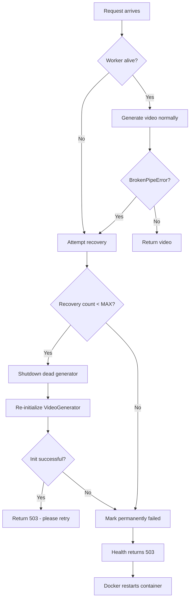

# Worker Crash Diagnosis & Recovery Plan

## Root Cause: Linux OOM Killer (Confirmed via dmesg)

The Linux OOM killer is silently killing worker subprocesses. Each worker uses ~71GB RSS (28GB anon + 43GB shmem). With 8 instances, total memory demand is ~568GB, exceeding the ~512GB system RAM + 8GB swap.

### dmesg Evidence

```
Out of memory: Killed process 998584 (python) total-vm:106866108kB, anon-rss:28010876kB, shmem-rss:42297408kB
Free swap = 0kB          <- swap completely exhausted
shmem: 82765076 pages    <- ~316 GB shared memory system-wide
free: 674048 pages       <- only ~2.6 GB free
```

### Why Workers Die Silently

The OOM killer sends `SIGKILL` — instant death, no Python cleanup, no logs. The multiprocessing pipe closes when the OS cleans up the dead process. Parent discovers this only when it tries [`pipe.send()`](fastvideo/worker/multiproc_executor.py:285) → `BrokenPipeError`.

### Affected Instances

Both instance-0 and instance-2 completed warmup successfully but their workers were OOM-killed during idle time before the first real request arrived.

---

## Implementation Plan

### Fix 1: Reduce Memory Pressure (docker-compose.yml)

Reduce from 8 to 6 instances as the immediate fix. This brings total memory from ~568GB to ~426GB, leaving ~86GB headroom for other services.

**File:** [`docker-compose.yml`](/mnt/nvme0/dc-disc-poc/worker/LTX2.3-Distilled/docker-compose.yml)

Changes:
- Comment out or remove `ltx2.3-distilled-6` and `ltx2.3-distilled-7` service definitions
- Add `mem_limit: 64g` and `memswap_limit: 64g` to the `x-ltx-base` anchor to prevent any single container from consuming unbounded memory

### Fix 2: Worker Health Detection + Recovery (pipeline.py)

**File:** [`pipeline.py`](/mnt/nvme0/dc-disc-poc/worker/LTX2.3-Distilled/app/models/pipeline.py)

Changes to [`VideoPipelineManager`](/mnt/nvme0/dc-disc-poc/worker/LTX2.3-Distilled/app/models/pipeline.py:35):

1. **Add recovery state to [`__init__`](/mnt/nvme0/dc-disc-poc/worker/LTX2.3-Distilled/app/models/pipeline.py:45)** — add `_recovery_count`, `_max_recoveries`, `_permanently_failed` instance variables

2. **Add [`_is_worker_alive()`](/mnt/nvme0/dc-disc-poc/worker/LTX2.3-Distilled/app/models/pipeline.py:45) method** — check `executor.workers[*].proc.is_alive()` via the generator's executor

3. **Add [`_recover_worker()`](/mnt/nvme0/dc-disc-poc/worker/LTX2.3-Distilled/app/models/pipeline.py:45) method** — shutdown dead generator, `torch.cuda.empty_cache()`, re-initialize via `initialize_pipelines()`, increment recovery counter

4. **Modify the `except Exception` block in [`generate_video()`](/mnt/nvme0/dc-disc-poc/worker/LTX2.3-Distilled/app/models/pipeline.py:345)** — detect `BrokenPipeError` in the error string, trigger `_recover_worker()`, return HTTP 503 instead of 500 so LiteLLM routes to another instance

### Fix 3: Health Check Worker Liveness (main.py)

**File:** [`main.py`](/mnt/nvme0/dc-disc-poc/worker/LTX2.3-Distilled/app/main.py)

Changes to [`/health` endpoint](/mnt/nvme0/dc-disc-poc/worker/LTX2.3-Distilled/app/main.py:124):

1. Check `pipeline_manager._permanently_failed` → return 503
2. Check `pipeline_manager.initialized` → return 503 if not
3. Check `pipeline_manager._is_worker_alive()` → return 503 if dead
4. Only return 200 "healthy" if all checks pass

Docker's healthcheck (`curl -f ... || exit 1`) will fail on 503 → container marked unhealthy → Docker restarts it after 3 retries.

---

## Recovery Flow



## Files to Modify

| File | Change | Priority |
|------|--------|----------|
| [`docker-compose.yml`](/mnt/nvme0/dc-disc-poc/worker/LTX2.3-Distilled/docker-compose.yml) | Reduce to 6 instances + add mem_limit | CRITICAL |
| [`pipeline.py`](/mnt/nvme0/dc-disc-poc/worker/LTX2.3-Distilled/app/models/pipeline.py) | Add worker liveness check, recovery, BrokenPipe detection | HIGH |
| [`main.py`](/mnt/nvme0/dc-disc-poc/worker/LTX2.3-Distilled/app/main.py) | Fix /health to check worker liveness | HIGH |
