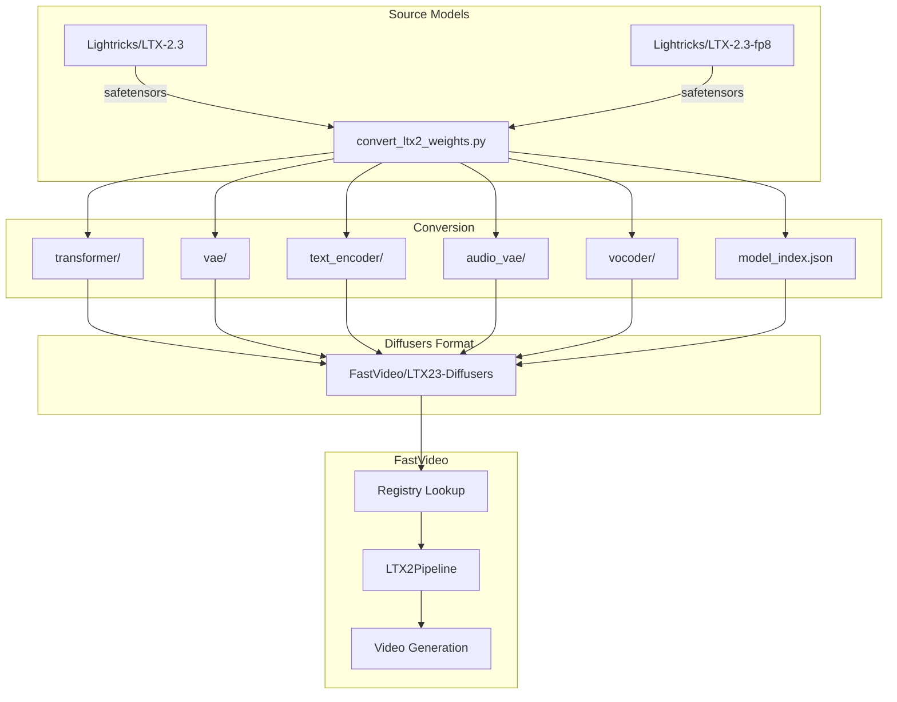

# Plan: Add Support for Lightricks/LTX-2.3 Models in FastVideo

## Overview

This plan outlines the steps needed to add comprehensive support for the LTX-2.3 model family to FastVideo. **Critical insight:** FastVideo uses Diffusers format, so models must be converted first using the existing conversion script.

## LTX-2.3 Model Family

Based on the official repository and Hugging Face, here are all the model variants:

| Model Name | Description | Steps | CFG | Precision |
|------------|-------------|-------|-----|-----------|
| ltx-2.3-22b-dev | Full model, flexible and trainable | 40 | 3.0 | BF16 |
| ltx-2.3-22b-distilled | Distilled version for fast inference | 8 | 1.0 | BF16 |
| ltx-2.3-22b-distilled-lora-384 | LoRA for distilled model, applicable to full model | 8 | 1.0 | BF16 |
| ltx-2.3-spatial-upscaler-x2-1.0 | 2x spatial upscaler for latents | - | - | BF16 |
| ltx-2.3-spatial-upscaler-x1.5-1.0 | 1.5x spatial upscaler for latents | - | - | BF16 |
| ltx-2.3-temporal-upscaler-x2-1.0 | 2x temporal upscaler for higher FPS | - | - | BF16 |

### FP8 Variants
- `Lightricks/LTX-2.3-fp8` - FP8 quantized version for faster inference and lower memory

## Critical Pre-requisite: Diffusers Conversion

FastVideo requires models in **Diffusers format**. The existing conversion script [`scripts/checkpoint_conversion/convert_ltx2_weights.py`](../scripts/checkpoint_conversion/convert_ltx2_weights.py) handles this for LTX-2 models.

### Existing Conversion Script Capabilities

The script already supports:
- Converting LTX-2 safetensors to Diffusers format
- Splitting weights by component (transformer, vae, audio_vae, vocoder, text_encoder)
- Generating `model_index.json` for pipeline discovery
- Copying Gemma tokenizer files
- Handling sharded weights

### Conversion Command Example (LTX-2)

```bash
python scripts/checkpoint_conversion/convert_ltx2_weights.py \
    --source "<PATH_TO_LOCAL_REPO>/Lightricks/LTX-2/ltx-2-19b-dev.safetensors" \
    --output "converted_weights/ltx2-base" \
    --class-name "LTX2Transformer3DModel" \
    --pipeline-class-name "LTX2Pipeline" \
    --diffusers-version "0.33.0.dev0" \
    --gemma-path "<PATH_TO_LOCAL_REPO>/google/gemma-3-12b-it"
```

## Implementation Plan

### Phase 0: Model Conversion (REQUIRED FIRST)

#### Step 0.1: Clone Official LTX-2 Repository

```bash
git clone https://github.com/ec-jt/LTX-2.git
```

#### Step 0.2: Download LTX-2.3 Models from Hugging Face

```bash
# Download full precision model
huggingface-cli download Lightricks/LTX-2.3 --local-dir ./LTX-2.3

# Download FP8 quantized model
huggingface-cli download Lightricks/LTX-2.3-fp8 --local-dir ./LTX-2.3-fp8
```

#### Step 0.3: Update Conversion Script for LTX-2.3

The existing `convert_ltx2_weights.py` may need updates for LTX-2.3:

1. **Check metadata format** - LTX-2.3 may have different metadata structure
2. **Handle FP8 weights** - Add support for FP8 tensor conversion
3. **Handle upscaler models** - These are different architectures

**File:** [`scripts/checkpoint_conversion/convert_ltx2_weights.py`](../scripts/checkpoint_conversion/convert_ltx2_weights.py)

```python
# Add FP8 handling
def _convert_fp8_weights(weights: dict[str, torch.Tensor]) -> dict[str, torch.Tensor]:
    """Convert FP8 weights to a format compatible with FastVideo."""
    converted = {}
    for key, value in weights.items():
        if value.dtype in (torch.float8_e4m3fn, torch.float8_e5m2):
            # Keep FP8 weights as-is, FastVideo's AbsMaxFP8 will handle them
            converted[key] = value
        else:
            converted[key] = value
    return converted
```

#### Step 0.4: Convert LTX-2.3 Models

```bash
# Convert LTX-2.3 dev (full precision)
python scripts/checkpoint_conversion/convert_ltx2_weights.py \
    --source "./LTX-2.3/ltx-2.3-22b-dev.safetensors" \
    --output "converted_weights/ltx23-dev" \
    --class-name "LTX2Transformer3DModel" \
    --pipeline-class-name "LTX2Pipeline" \
    --gemma-path "./google/gemma-3-12b-it"

# Convert LTX-2.3 distilled
python scripts/checkpoint_conversion/convert_ltx2_weights.py \
    --source "./LTX-2.3/ltx-2.3-22b-distilled.safetensors" \
    --output "converted_weights/ltx23-distilled" \
    --class-name "LTX2Transformer3DModel" \
    --pipeline-class-name "LTX2Pipeline" \
    --gemma-path "./google/gemma-3-12b-it"

# Convert LTX-2.3 FP8
python scripts/checkpoint_conversion/convert_ltx2_weights.py \
    --source "./LTX-2.3-fp8/ltx-2.3-22b-fp8.safetensors" \
    --output "converted_weights/ltx23-fp8" \
    --class-name "LTX2Transformer3DModel" \
    --pipeline-class-name "LTX2Pipeline" \
    --gemma-path "./google/gemma-3-12b-it"
```

### Phase 1: Core Model Support

#### Step 1.1: Register LTX-2.3 Model Paths

**File:** [`fastvideo/registry.py`](../fastvideo/registry.py)

After conversion, register the converted model paths:

```python
# LTX-2.3 (dev/base) - requires conversion first
register_configs(
    sampling_param_cls=LTX23BaseSamplingParam,
    pipeline_config_cls=LTX2T2VConfig,  # Reuse existing config
    hf_model_paths=[
        "FastVideo/LTX23-dev-Diffusers",  # After upload to HF
        "Lightricks/LTX-2.3",  # If they provide Diffusers format
    ],
    model_detectors=[
        lambda path: "ltx-2.3" in path.lower() and "distilled" not in path.lower() and "fp8" not in path.lower(),
    ],
)

# LTX-2.3 (distilled)
register_configs(
    sampling_param_cls=LTX23DistilledSamplingParam,
    pipeline_config_cls=LTX2T2VConfig,
    hf_model_paths=[
        "FastVideo/LTX23-distilled-Diffusers",
    ],
    model_detectors=[
        lambda path: "ltx-2.3" in path.lower() and "distilled" in path.lower() and "fp8" not in path.lower(),
    ],
)

# LTX-2.3 FP8
register_configs(
    sampling_param_cls=LTX23BaseSamplingParam,
    pipeline_config_cls=LTX2T2VConfig,
    hf_model_paths=[
        "FastVideo/LTX23-fp8-Diffusers",
        "Lightricks/LTX-2.3-fp8",
    ],
    model_detectors=[
        lambda path: "ltx-2.3" in path.lower() and "fp8" in path.lower(),
    ],
)
```

#### Step 1.2: Add LTX-2.3 Sampling Parameters

**File:** [`fastvideo/configs/sample/ltx2.py`](../fastvideo/configs/sample/ltx2.py)

```python
@dataclass
class LTX23BaseSamplingParam(SamplingParam):
    """Default sampling parameters for LTX-2.3 dev/base T2V."""
    
    seed: int = 10
    num_frames: int = 121
    height: int = 512
    width: int = 768
    fps: int = 24
    num_inference_steps: int = 40
    guidance_scale: float = 3.0
    negative_prompt: str = ""  # Update with official default if any


@dataclass
class LTX23DistilledSamplingParam(SamplingParam):
    """Default sampling parameters for LTX-2.3 distilled T2V."""
    
    seed: int = 10
    num_frames: int = 121
    height: int = 1024
    width: int = 1536
    fps: int = 24
    num_inference_steps: int = 8  # Distilled uses 8 steps
    guidance_scale: float = 1.0  # CFG=1 for distilled
    negative_prompt: str = ""
```

### Phase 2: FP8 Quantization Support

#### Step 2.1: Verify FP8 Weight Format

Inspect the `Lightricks/LTX-2.3-fp8` model to understand:
- Weight tensor dtypes (float8_e4m3fn, float8_e5m2, etc.)
- Scale tensor format and naming convention
- Quantization granularity (per-tensor, per-channel, per-block)

#### Step 2.2: Update Weight Loader for FP8

**File:** [`fastvideo/models/loader/component_loader.py`](../fastvideo/models/loader/component_loader.py)

Ensure the transformer loader can:
1. Detect FP8 quantized weights from config or tensor dtypes
2. Pass quantization config to model initialization
3. Load FP8 tensors and their scales correctly

```python
def _detect_fp8_quantization(weights: dict[str, torch.Tensor]) -> bool:
    """Detect if weights contain FP8 tensors."""
    for tensor in weights.values():
        if tensor.dtype in (torch.float8_e4m3fn, torch.float8_e5m2):
            return True
    return False
```

### Phase 3: Upscaler Support (Future)

The upscaler models (spatial and temporal) are different architectures and will need:
1. New model classes in `fastvideo/models/upsamplers/`
2. New pipeline stages for multi-scale inference
3. Separate conversion handling

### Phase 4: Upload Converted Models to HuggingFace

After conversion and testing, upload to HuggingFace:

```bash
# Upload converted models
python scripts/huggingface/upload_hf.py \
    --local-dir "converted_weights/ltx23-dev" \
    --repo-id "FastVideo/LTX23-dev-Diffusers"

python scripts/huggingface/upload_hf.py \
    --local-dir "converted_weights/ltx23-distilled" \
    --repo-id "FastVideo/LTX23-distilled-Diffusers"

python scripts/huggingface/upload_hf.py \
    --local-dir "converted_weights/ltx23-fp8" \
    --repo-id "FastVideo/LTX23-fp8-Diffusers"
```

## Architecture Diagram



## Files to Create/Modify

### Modified Files
1. [`scripts/checkpoint_conversion/convert_ltx2_weights.py`](../scripts/checkpoint_conversion/convert_ltx2_weights.py) - Add FP8 support
2. [`fastvideo/registry.py`](../fastvideo/registry.py) - Add LTX-2.3 model registrations
3. [`fastvideo/configs/sample/ltx2.py`](../fastvideo/configs/sample/ltx2.py) - Add LTX-2.3 sampling params
4. [`fastvideo/models/loader/component_loader.py`](../fastvideo/models/loader/component_loader.py) - FP8 loading support

### New Files
1. `examples/inference/basic/basic_ltx23.py` - Basic example
2. `examples/inference/basic/basic_ltx23_fp8.py` - FP8 example
3. `docs/inference/ltx23.md` - Documentation

## Testing Plan

1. **Conversion Test**
   - Convert each LTX-2.3 variant
   - Verify output directory structure
   - Check model_index.json validity

2. **Loading Test**
   - Load converted models with FastVideo
   - Verify weight shapes and dtypes
   - Check FP8 tensor handling

3. **Inference Test**
   - Generate video with each variant
   - Compare output quality with official implementation

## Implementation Priority

1. **High Priority** (Core functionality)
   - Update conversion script for LTX-2.3
   - Convert and test ltx-2.3-22b-dev
   - Convert and test ltx-2.3-22b-distilled
   - Register models in FastVideo

2. **Medium Priority** (FP8 support)
   - Handle FP8 weight conversion
   - Test FP8 inference

3. **Lower Priority** (Enhanced features)
   - Upscaler models
   - LoRA support
   - Upload to HuggingFace

## Next Steps

1. Clone the official LTX-2 repository
2. Download LTX-2.3 models from HuggingFace
3. Test existing conversion script with LTX-2.3
4. Update conversion script if needed
5. Switch to **Code mode** to implement changes
