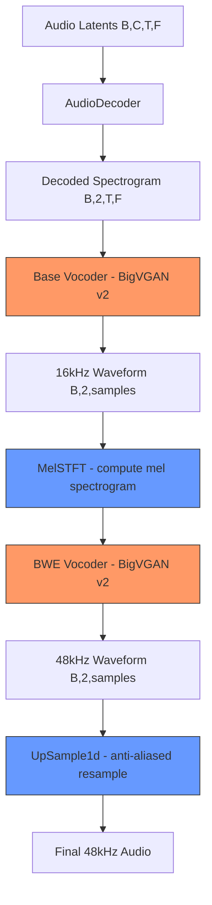

# LTX-2.3 Audio Vocoder Fix — BigVGAN v2 + BWE Implementation

## Problem

The LTX-2.3 audio output is buzzing/static noise because FastVideo's vocoder implementation is missing critical components that the LTX-2.3 checkpoint requires:

1. **Wrong resblock architecture**: Checkpoint uses `resblock: "AMP1"` (BigVGAN v2) but FastVideo only has `ResBlock1`/`ResBlock2`
2. **Missing snake/snakebeta activations**: BigVGAN v2 uses learnable snake activations instead of LeakyReLU
3. **Missing Bandwidth Extension (BWE)**: Checkpoint has a BWE section that upsamples 16kHz → 48kHz audio
4. **Wrong config nesting**: `VocoderConfigurator` was reading from wrong level of nested config

## Reference Implementation

All source code is in the upstream LTX-2 repo:
- **Vocoder + BWE**: [`/home/ubuntu/LTX-2/packages/ltx-core/src/ltx_core/model/audio_vae/vocoder.py`](/home/ubuntu/LTX-2/packages/ltx-core/src/ltx_core/model/audio_vae/vocoder.py)
- **Configurator**: [`/home/ubuntu/LTX-2/packages/ltx-core/src/ltx_core/model/audio_vae/model_configurator.py`](/home/ubuntu/LTX-2/packages/ltx-core/src/ltx_core/model/audio_vae/model_configurator.py)

## Architecture



## Implementation Steps

### Step 1: Port BigVGAN v2 activation functions

**Target file**: [`fastvideo/models/audio/ltx2_audio_vae.py`](fastvideo/models/audio/ltx2_audio_vae.py)

**Reference**: [`vocoder.py` lines 1-130](../LTX-2/packages/ltx-core/src/ltx_core/model/audio_vae/vocoder.py)

Port these classes:
- `SnakeBeta` — Learnable snake activation: `x + (1/b) * sin^2(a*x)` with per-channel `alpha` and `beta` parameters
- `Activation1d` — Wraps activation with optional anti-aliased upsampling/downsampling
- `UpSample1d` — Kaiser-windowed sinc interpolation upsampler (used for anti-aliasing and BWE)
- `AMPBlock1` — BigVGAN v2 residual block using `Activation1d(SnakeBeta(...))` instead of LeakyReLU

### Step 2: Update Vocoder class

**Target file**: [`fastvideo/models/audio/ltx2_audio_vae.py`](fastvideo/models/audio/ltx2_audio_vae.py) — `Vocoder` class at line 1084

**Reference**: [`vocoder.py` lines 271-416](../LTX-2/packages/ltx-core/src/ltx_core/model/audio_vae/vocoder.py)

Changes needed:
- Add `activation`, `use_tanh_at_final`, `apply_final_activation`, `use_bias_at_final` parameters
- When `resblock="AMP1"`, use `AMPBlock1` instead of `ResBlock1`/`ResBlock2`
- When `resblock="AMP1"`, use `Activation1d(SnakeBeta(...))` as `act_post` instead of `LeakyReLU`
- Add `self.is_amp` flag to control activation in forward loop
- Update `forward()` to use `self.act_post` instead of hardcoded `F.leaky_relu`

### Step 3: Port STFT and MelSTFT modules

**Target file**: [`fastvideo/models/audio/ltx2_audio_vae.py`](fastvideo/models/audio/ltx2_audio_vae.py)

**Reference**: [`vocoder.py` lines 419-494](../LTX-2/packages/ltx-core/src/ltx_core/model/audio_vae/vocoder.py)

Port these classes:
- `_STFTFn` — Causal STFT as convolution with precomputed DFT bases (loaded from checkpoint)
- `MelSTFT` — Log-mel spectrogram using `_STFTFn` + mel filterbank (loaded from checkpoint)

### Step 4: Port VocoderWithBWE

**Target file**: [`fastvideo/models/audio/ltx2_audio_vae.py`](fastvideo/models/audio/ltx2_audio_vae.py)

**Reference**: [`vocoder.py` lines 497-576](../LTX-2/packages/ltx-core/src/ltx_core/model/audio_vae/vocoder.py)

Port `VocoderWithBWE` class:
- Chains base vocoder → MelSTFT → BWE vocoder → UpSample1d
- Base vocoder produces 16kHz stereo waveform
- MelSTFT computes mel spectrogram from 16kHz waveform
- BWE vocoder generates high-frequency content from mel
- UpSample1d resamples to 48kHz
- Final output combines base + BWE upsampled

### Step 5: Update VocoderConfigurator (already partially done)

**Target file**: [`fastvideo/models/audio/ltx2_audio_vae.py`](fastvideo/models/audio/ltx2_audio_vae.py) — `VocoderConfigurator` class

**Reference**: [`model_configurator.py` lines 42-95](../LTX-2/packages/ltx-core/src/ltx_core/model/audio_vae/model_configurator.py)

The config nesting fix is already applied. Need to:
- Pass `apply_final_activation=False` to base vocoder when BWE is present
- Pass correct `output_sampling_rate` to base vocoder (from BWE `input_sampling_rate`)
- Create `VocoderWithBWE` with correct MelSTFT parameters

### Step 6: Update LTX2Vocoder wrapper and weight loading

**Target file**: [`fastvideo/models/audio/ltx2_audio_vae.py`](fastvideo/models/audio/ltx2_audio_vae.py) — `LTX2Vocoder` class

Changes:
- `LTX2Vocoder.__init__` should create `VocoderWithBWE` when BWE config is present
- Weight loading needs to handle the nested vocoder/bwe weight prefixes
- Update `DEFAULT_LTX2_VOCODER_OUTPUT_SAMPLE_RATE` to 48000 when BWE is used

### Step 7: Update audio decoding stage

**Target file**: [`fastvideo/pipelines/stages/ltx2_audio_decoding.py`](fastvideo/pipelines/stages/ltx2_audio_decoding.py)

Changes:
- Get `output_sampling_rate` from the vocoder model instead of hardcoded constant
- Handle the VocoderWithBWE output shape

### Step 8: Update checkpoint conversion

**Target file**: [`scripts/checkpoint_conversion/convert_ltx2_weights.py`](scripts/checkpoint_conversion/convert_ltx2_weights.py)

Verify that vocoder weights are correctly split with the right prefixes for:
- `vocoder.vocoder.*` → base vocoder weights
- `vocoder.bwe.*` → BWE vocoder weights  
- `vocoder.mel_stft.*` → MelSTFT weights (DFT bases + mel filterbank)

### Step 9: Test

```bash
# Quick test with distilled model
python tests/helix/test_ltx2_video_generation.py --quick \
    --model-path /mnt/nvme0/models/FastVideo/LTX2.3-Distilled-Diffusers \
    --num-gpus 8 --tp-size 8

# Dev model test
python tests/helix/test_ltx2_video_generation.py --quick \
    --model-path /mnt/nvme0/models/FastVideo/LTX2.3-Dev-Diffusers \
    --num-gpus 8 --tp-size 8
```

## Vocoder Weight Key Mapping

From the upstream [`model_configurator.py`](../LTX-2/packages/ltx-core/src/ltx_core/model/audio_vae/model_configurator.py):

```
Checkpoint key prefix → FastVideo model attribute
vocoder.vocoder.*     → model.base_vocoder.*     (or model.vocoder.* for VocoderWithBWE)
vocoder.bwe.*         → model.bwe_vocoder.*
vocoder.mel_stft.*    → model.mel_stft.*
vocoder.resampler.*   → model.resampler.*
```

## Key Differences from Current Implementation

| Aspect | Current FastVideo | Upstream LTX-2.3 |
|--------|------------------|-------------------|
| Resblock | `ResBlock1` / `ResBlock2` | `AMPBlock1` (BigVGAN v2) |
| Activation | `LeakyReLU` | `SnakeBeta` via `Activation1d` |
| Final activation | Always `tanh` | Configurable: `tanh` / `clamp` / none |
| BWE | Not implemented | `VocoderWithBWE` chains base + BWE |
| Output rate | 24kHz (hardcoded) | 48kHz (via BWE upsampling) |
| Config reading | Flat `config["vocoder"]` | Nested `config["vocoder"]["vocoder"]` + `config["vocoder"]["bwe"]` |
