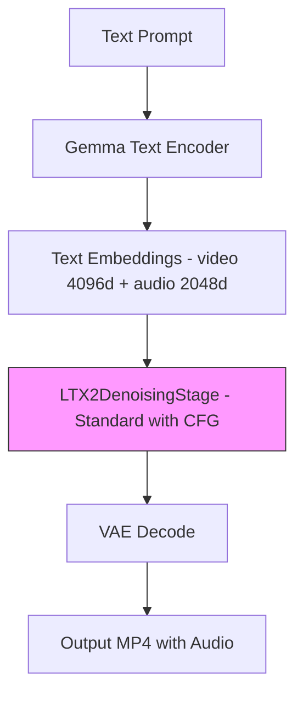

# LTX-2.3 Dev One-Stage Pipeline Setup

## Goal

Set up the straightforward LTX-2.3 dev (non-distilled) one-stage pipeline as a working baseline. This uses the standard `LTX2Pipeline` with CFG guidance, matching the reference [`ti2vid_one_stage.py`](/home/ubuntu/LTX-2/packages/ltx-pipelines/src/ltx_pipelines/ti2vid_one_stage.py).

Once this baseline works correctly, we can compare it with the distilled pipeline to identify what is causing the audio buzzing and visual issues.

## Architecture



Key differences from distilled pipeline:
- Uses standard `LTX2DenoisingStage` with CFG guidance
- 30 inference steps with `LTX2Scheduler` sigma schedule
- `guidance_scale=3.0`, `stg_scale=1.0`
- Single stage at full resolution - no spatial upsampler needed
- Resolution must be divisible by 32 (not 64)

## Steps

### 1. Convert ltx-2.3-22b-dev weights to diffusers format

The conversion script already exists at [`scripts/checkpoint_conversion/convert_ltx2_weights.py`](scripts/checkpoint_conversion/convert_ltx2_weights.py).

```bash
source .venv/bin/activate
python scripts/checkpoint_conversion/convert_ltx2_weights.py \
    --source /mnt/nvme0/models/Lightricks/LTX-2.3/ltx-2.3-22b-dev.safetensors \
    --output /mnt/nvme0/models/FastVideo/LTX2.3-Dev-Diffusers \
    --class-name LTX2Transformer3DModel \
    --pipeline-class-name LTX2Pipeline \
    --gemma-path /mnt/nvme0/models/FastVideo/LTX2.3-Distilled-Diffusers/text_encoder/gemma
```

This will:
- Split the single safetensors file into components: transformer, vae, audio_vae, vocoder, text_encoder
- Apply the `PARAM_NAME_MAP` to rename transformer keys
- Generate `model_index.json` pointing to `LTX2Pipeline`
- Copy Gemma tokenizer from the existing distilled model

### 2. Register LTX-2.3 dev model in registry

The existing [`LTX23BaseSamplingParam`](fastvideo/configs/sample/ltx2.py:92) already has the correct defaults for the dev model:
- `num_inference_steps=30`
- `guidance_scale=3.0`
- `ltx2_cfg_scale_video=3.0`
- `ltx2_cfg_scale_audio=7.0`
- `ltx2_stg_scale_video=1.0`

Need to add a registry entry in [`fastvideo/registry.py`](fastvideo/registry.py) that maps the dev model path to `LTX23BaseSamplingParam`.

### 3. Verify the pipeline class

The dev model uses the standard [`LTX2Pipeline`](fastvideo/pipelines/basic/ltx2/ltx2_pipeline.py) which uses [`LTX2DenoisingStage`](fastvideo/pipelines/stages/ltx2_denoising.py) with full CFG/STG guidance. This pipeline already exists and should work.

**Important**: The `caption_projection` fix we applied also affects the dev model since it uses `cross_attention_adaln=True`. The fix correctly skips creating `caption_projection` for LTX-2.3 models.

### 4. Test the one-stage dev pipeline

```bash
source .venv/bin/activate
python tests/helix/test_ltx2_video_generation.py \
    --model-path /mnt/nvme0/models/FastVideo/LTX2.3-Dev-Diffusers \
    --quick \
    --num-gpus 8 --tp-size 8 \
    --steps 30 \
    --height 512 --width 768
```

### 5. Compare with distilled pipeline

Once the dev pipeline produces good quality output:
- Compare audio quality between dev and distilled
- Compare video quality between dev and distilled
- If dev works but distilled doesn't, the issue is in the distilled-specific code
- If both have issues, the problem is in shared code like the caption_projection fix or the denoising loop

## Key Considerations

### Caption Projection

Both dev and distilled LTX-2.3 models use `cross_attention_adaln=True`, which means:
- `caption_projection` is NOT in the transformer (handled by text encoder)
- Our fix correctly skips creating it for both models
- The dev model will validate that this fix works correctly with CFG guidance

### Sigma Schedule

The dev model uses `LTX2Scheduler` to compute sigmas from `num_inference_steps`:
- Reference: `sigmas = LTX2Scheduler().execute(steps=30)`
- FastVideo: Uses `_ltx2_sigmas()` in [`ltx2_denoising.py`](fastvideo/pipelines/stages/ltx2_denoising.py:48)

### Audio

The dev model uses the same audio path as distilled. If audio works in dev but not distilled, the issue is in the distilled denoising stage's audio handling.

## Files to Modify

1. **No new pipeline code needed** - uses existing `LTX2Pipeline`
2. [`fastvideo/registry.py`](fastvideo/registry.py) - Add dev model path detection
3. [`tests/helix/test_ltx2_video_generation.py`](tests/helix/test_ltx2_video_generation.py) - Add dev model test config
