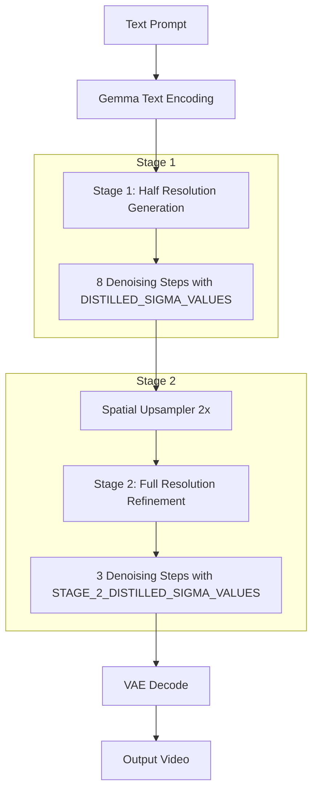

# LTX-2.3 Distilled Pipeline Implementation Plan

## Overview

This document outlines the implementation plan for the LTX-2.3 Distilled Pipeline in FastVideo. The distilled pipeline is a **two-stage pipeline** that provides the fastest inference with high quality output.

## Reference Implementation Analysis

Based on the official LTX-2 implementation at `/home/ubuntu/LTX-2/packages/ltx-pipelines/src/ltx_pipelines/distilled.py`:

### Key Parameters

```python
# Stage 1: 8 denoising steps at half resolution
DISTILLED_SIGMA_VALUES = [1.0, 0.99375, 0.9875, 0.98125, 0.975, 0.909375, 0.725, 0.421875, 0.0]

# Stage 2: 3 refinement steps after spatial upsampling
STAGE_2_DISTILLED_SIGMA_VALUES = [0.909375, 0.725, 0.421875, 0.0]
```

### Pipeline Flow



### Key Differences from Standard Pipeline

| Aspect | Standard Pipeline | Distilled Pipeline |
|--------|------------------|-------------------|
| Denoising Steps | 30-40 steps | 8 + 3 = 11 total steps |
| Sigma Schedule | Computed dynamically | Fixed predefined values |
| Resolution | Full resolution | Half → Full with upsampling |
| CFG Scale | 3.0 | 1.0 (no CFG) |
| Guidance | Multi-modal CFG + STG | Simple denoising (no guidance) |

## Implementation Architecture

### New Files to Create

1. **`fastvideo/pipelines/basic/ltx2/ltx2_distilled_pipeline.py`**
   - Two-stage pipeline orchestration
   - Manages stage 1 → upsampler → stage 2 flow

2. **`fastvideo/pipelines/stages/ltx2_distilled_denoising.py`**
   - Simplified denoising without CFG/STG
   - Uses fixed sigma schedules
   - Supports both stage 1 and stage 2 modes

3. **`fastvideo/models/upsamplers/ltx2_spatial_upsampler.py`**
   - Latent space 2x spatial upsampler
   - Based on reference LatentUpsampler model

4. **`fastvideo/configs/models/upsamplers/ltx2_upsampler.py`**
   - Configuration for the spatial upsampler

### Modified Files

1. **`fastvideo/configs/sample/ltx2.py`**
   - Add `LTX23DistilledTwoStageSamplingParam` class

2. **`fastvideo/pipelines/stages/__init__.py`**
   - Export new distilled denoising stage

3. **`fastvideo/pipelines/basic/ltx2/__init__.py`**
   - Export new distilled pipeline

4. **`tests/helix/test_ltx2_video_generation.py`**
   - Update to use distilled pipeline with correct parameters

## Detailed Implementation

### 1. LTX2DistilledDenoisingStage

```python
# Key constants
DISTILLED_SIGMA_VALUES = [1.0, 0.99375, 0.9875, 0.98125, 0.975, 0.909375, 0.725, 0.421875, 0.0]
STAGE_2_DISTILLED_SIGMA_VALUES = [0.909375, 0.725, 0.421875, 0.0]

class LTX2DistilledDenoisingStage(PipelineStage):
    def __init__(self, transformer, stage: int = 1):
        self.transformer = transformer
        self.stage = stage  # 1 or 2
        
    def forward(self, batch, fastvideo_args):
        # Select sigma schedule based on stage
        if self.stage == 1:
            sigmas = torch.tensor(DISTILLED_SIGMA_VALUES, device=device)
        else:
            sigmas = torch.tensor(STAGE_2_DISTILLED_SIGMA_VALUES, device=device)
        
        # Simple denoising loop (no CFG, no STG)
        for step_index in range(len(sigmas) - 1):
            sigma = sigmas[step_index]
            sigma_next = sigmas[step_index + 1]
            
            # Single forward pass (no guidance)
            denoised = self.transformer(
                hidden_states=latents,
                encoder_hidden_states=prompt_embeds,
                timestep=timestep,
                audio_hidden_states=audio_latents,
                audio_encoder_hidden_states=audio_context,
                audio_timestep=audio_timestep,
            )
            
            # Euler step
            dt = sigma_next - sigma
            velocity = (latents - denoised) / sigma
            latents = latents + velocity * dt
```

### 2. LTX2SpatialUpsampler

```python
class LTX2SpatialUpsampler(nn.Module):
    def __init__(
        self,
        in_channels: int = 128,
        mid_channels: int = 512,
        num_blocks_per_stage: int = 4,
        spatial_scale: float = 2.0,
    ):
        # ResBlocks → PixelShuffle 2x → ResBlocks
        
    def forward(self, latent, vae_encoder=None):
        # Un-normalize → Upsample → Re-normalize
        if vae_encoder is not None:
            latent = vae_encoder.per_channel_statistics.un_normalize(latent)
        latent = self._upsample(latent)
        if vae_encoder is not None:
            latent = vae_encoder.per_channel_statistics.normalize(latent)
        return latent
```

### 3. LTX2DistilledPipeline

```python
class LTX2DistilledPipeline(ComposedPipelineBase):
    _required_config_modules = [
        "text_encoder",
        "tokenizer", 
        "transformer",
        "vae",
        "spatial_upsampler",  # NEW
        "audio_vae",
        "vocoder",
    ]
    
    def create_pipeline_stages(self, fastvideo_args):
        # Input validation
        self.add_stage("input_validation_stage", InputValidationStage())
        
        # Text encoding
        self.add_stage("prompt_encoding_stage", LTX2TextEncodingStage(...))
        
        # Stage 1: Half resolution latent preparation
        self.add_stage("stage1_latent_preparation", 
            LTX2DistilledLatentPreparationStage(
                transformer=self.get_module("transformer"),
                resolution_scale=0.5,  # Half resolution
            ))
        
        # Stage 1: Denoising at half resolution
        self.add_stage("stage1_denoising",
            LTX2DistilledDenoisingStage(
                transformer=self.get_module("transformer"),
                stage=1,
            ))
        
        # Spatial upsampling 2x
        self.add_stage("spatial_upsampling",
            LTX2SpatialUpsamplingStage(
                upsampler=self.get_module("spatial_upsampler"),
                vae=self.get_module("vae"),
            ))
        
        # Stage 2: Full resolution refinement
        self.add_stage("stage2_denoising",
            LTX2DistilledDenoisingStage(
                transformer=self.get_module("transformer"),
                stage=2,
            ))
        
        # Audio decoding
        self.add_stage("audio_decoding_stage", LTX2AudioDecodingStage(...))
        
        # Video decoding
        self.add_stage("decoding_stage", DecodingStage(...))
```

### 4. Sampling Parameters

```python
@dataclass
class LTX23DistilledTwoStageSamplingParam(SamplingParam):
    """Two-stage distilled pipeline parameters."""
    
    seed: int = 10
    num_frames: int = 121
    # Final output resolution
    height: int = 1024
    width: int = 1536
    fps: int = 24
    
    # Stage 1: 8 steps at half resolution
    stage1_num_inference_steps: int = 8
    # Stage 2: 3 refinement steps at full resolution  
    stage2_num_inference_steps: int = 3
    
    # No CFG for distilled models
    guidance_scale: float = 1.0
    negative_prompt: str = ""
    
    # Disable all guidance
    ltx2_cfg_scale_video: float = 1.0
    ltx2_cfg_scale_audio: float = 1.0
    ltx2_modality_scale_video: float = 1.0
    ltx2_modality_scale_audio: float = 1.0
    ltx2_stg_scale_video: float = 0.0
    ltx2_stg_scale_audio: float = 0.0
```

## Test Script Updates

```python
# tests/helix/test_ltx2_video_generation.py

@dataclass
class VideoConfig:
    prompt: str
    num_frames: int
    height: int  # Final output height
    width: int   # Final output width
    seed: int = 42
    # Two-stage steps
    stage1_steps: int = 8
    stage2_steps: int = 3

def run_video_generation_test(config, ...):
    generator = VideoGenerator.from_pretrained(
        model_path,
        num_gpus=num_gpus,
        tp_size=tp_size,
        use_fsdp_inference=use_fsdp_inference,
        pipeline_class="LTX2DistilledPipeline",  # Use distilled pipeline
    )
    
    video = generator.generate_video(
        prompt=config.prompt,
        num_frames=config.num_frames,
        height=config.height,
        width=config.width,
        seed=config.seed,
        guidance_scale=1.0,  # No CFG
        # Pipeline will handle two-stage internally
    )
```

## Model Requirements

The distilled pipeline requires:

1. **Distilled Transformer Checkpoint**: `/mnt/nvme0/models/FastVideo/LTX2.3-Distilled-Diffusers`
2. **Spatial Upsampler Checkpoint**: Needs to be downloaded/converted
   - Reference path in LTX-2: `spatial_upsampler_path`
   - Model architecture: `LatentUpsampler` with 2x spatial scale

## Conversion Notes

The spatial upsampler weights need to be:
1. Downloaded from the official LTX-2.3 release
2. Converted to FastVideo format using the existing conversion script
3. Placed in the model directory structure

## Implementation Order

1. **Phase 1: Core Components**
   - [ ] Implement `LTX2SpatialUpsampler` model
   - [ ] Implement `LTX2DistilledDenoisingStage`
   - [ ] Add upsampler config and loader support

2. **Phase 2: Pipeline Integration**
   - [ ] Create `LTX2DistilledPipeline`
   - [ ] Add `LTX2SpatialUpsamplingStage`
   - [ ] Update sampling parameters

3. **Phase 3: Testing**
   - [ ] Update test script
   - [ ] Validate output quality against reference
   - [ ] Performance benchmarking

## Quality Validation

Compare outputs against reference implementation:
- Visual quality (SSIM, LPIPS)
- Audio sync (if applicable)
- Generation speed
- Memory usage

## Notes

- The distilled pipeline is significantly faster (11 steps vs 30-40)
- No classifier-free guidance means single forward pass per step
- Two-stage approach maintains quality while reducing computation
- Spatial upsampler operates in latent space (efficient)
