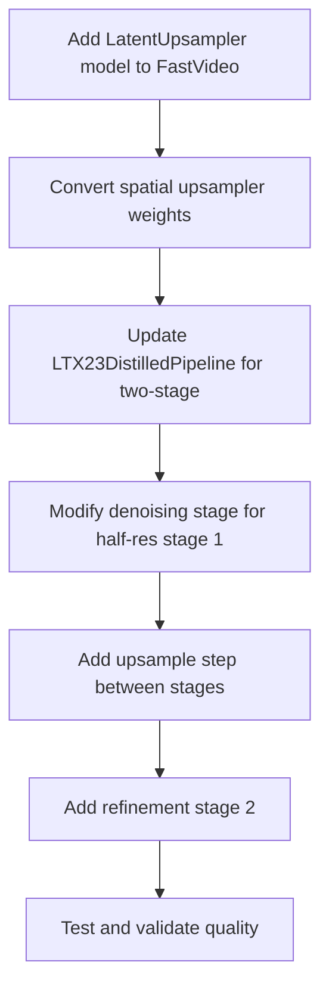

# LTX-2.3 Distilled Pipeline Quality Fix

## Root Cause Analysis

After investigating the audio buzzing and visual artifacts reported in the LTX-2.3 distilled pipeline output, I've identified the **root cause**:

### The Problem: Single-Stage vs Two-Stage Pipeline

Our current implementation runs a **single-stage pipeline at full resolution**, but the reference LTX-2 distilled pipeline is a **two-stage pipeline**:

```
Reference DistilledPipeline Architecture:
┌─────────────────────────────────────────────────────────────────┐
│ Stage 1: Half Resolution Generation                             │
│ - Resolution: width/2 × height/2                                │
│ - Steps: 8 using DISTILLED_SIGMA_VALUES                         │
│ - Output: Low-res video latent + audio latent                   │
└─────────────────────────────────────────────────────────────────┘
                              │
                              ▼
┌─────────────────────────────────────────────────────────────────┐
│ Spatial Upsampler                                               │
│ - Model: LatentUpsampler                                        │
│ - Operation: 2x upsample in latent space                        │
│ - Weights: ltx-2.3-spatial-upscaler-x2-1.0.safetensors          │
└─────────────────────────────────────────────────────────────────┘
                              │
                              ▼
┌─────────────────────────────────────────────────────────────────┐
│ Stage 2: Full Resolution Refinement                             │
│ - Resolution: width × height (full)                             │
│ - Steps: 3 using STAGE_2_DISTILLED_SIGMA_VALUES                 │
│ - Initial sigma: 0.909375 (not pure noise)                      │
│ - Uses upsampled video latent + stage 1 audio latent            │
└─────────────────────────────────────────────────────────────────┘
```

### Why This Matters

1. **Visual Artifacts**: The distilled model was trained to generate at half resolution first, then refine. Running it at full resolution in a single stage produces artifacts because:
   - The model expects to work with lower-resolution features initially
   - The refinement stage adds high-frequency details that the first stage doesn't produce

2. **Audio Buzzing**: The audio generation path may be affected by:
   - Incorrect latent shapes when running at full resolution
   - Missing the refinement stage that cleans up audio artifacts

### Verification: Euler Step is Correct

I verified that our Euler step implementation matches the reference exactly:

```python
# Reference (ltx_core/utils.py + diffusion_steps.py)
velocity = (sample - denoised_sample) / sigma
return (sample + velocity * dt).to(sample.dtype)

# Our implementation (ltx2_distilled_denoising.py)
velocity = (latents.float() - denoised.float()) / sigma_value
latents = (latents.float() + velocity.float() * dt).to(latents.dtype)
```

Both are mathematically identical.

## Solution: Implement Two-Stage Pipeline

### Required Components

1. **LatentUpsampler Model**
   - Port from `/home/ubuntu/LTX-2/packages/ltx-core/src/ltx_core/model/upsampler/model.py`
   - Simple convolutional network that upsamples latents 2x
   - Weights at `/mnt/nvme0/models/Lightricks/LTX-2.3/ltx-2.3-spatial-upscaler-x2-1.0.safetensors`

2. **Two-Stage Denoising Stage**
   - Stage 1: Generate at half resolution with 8 steps
   - Upsample latents using LatentUpsampler
   - Stage 2: Refine at full resolution with 3 steps

3. **Weight Conversion**
   - Convert spatial upsampler weights to diffusers format
   - Add to model directory structure

### Implementation Plan



### Code Changes Required

1. **New file: `fastvideo/models/upsamplers/latent_upsampler.py`**
   - Port LatentUpsampler from ltx-core
   - Simple 2x upsampling in latent space

2. **Update: `fastvideo/pipelines/stages/ltx2_distilled_denoising.py`**
   - Add two-stage logic
   - Stage 1 at half resolution
   - Upsample between stages
   - Stage 2 refinement

3. **Update: `scripts/checkpoint_conversion/convert_ltx2_weights.py`**
   - Add spatial upsampler conversion

4. **Update: `fastvideo/pipelines/basic/ltx2/ltx2_distilled_pipeline.py`**
   - Load spatial upsampler model
   - Pass to denoising stage

### Alternative: Single-Stage at Half Resolution

If the spatial upsampler is not available or conversion is complex, we could:
1. Run single-stage at half resolution
2. Use VAE decode at half resolution
3. Upsample the decoded video in pixel space

This would be faster but lower quality than the two-stage approach.

## Sigma Schedules Reference

```python
# Stage 1: 8 denoising steps
DISTILLED_SIGMA_VALUES = [
    1.0, 0.99375, 0.9875, 0.98125, 0.975,
    0.909375, 0.725, 0.421875, 0.0,
]

# Stage 2: 3 refinement steps (starts from 0.909375, not 1.0)
STAGE_2_DISTILLED_SIGMA_VALUES = [0.909375, 0.725, 0.421875, 0.0]
```

Note: Stage 2 starts from `sigma=0.909375` because the upsampled latent is not pure noise - it's a partially denoised representation that needs refinement.

## Next Steps

1. Port LatentUpsampler model to FastVideo
2. Convert spatial upsampler weights
3. Implement two-stage denoising logic
4. Test with the same prompts to verify quality improvement
