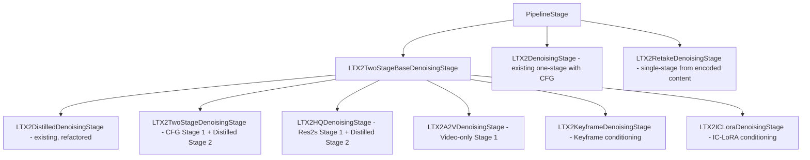
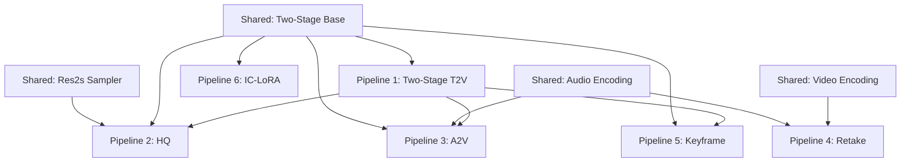

# LTX-2.3 Missing Pipelines — Detailed Implementation Plan

## Model Compatibility Matrix

> **CRITICAL:** Not all pipelines use the same checkpoint type. The upstream
> code auto-detects LTX-2.0 vs LTX-2.3 via `model_version` metadata in the
> safetensors file. FastVideo currently has working support for:
> - **LTX-2.3 Dev** (non-distilled) — used by `LTX2Pipeline` (one-stage)
> - **LTX-2.3 Distilled** — used by `LTX23DistilledPipeline`

| Pipeline | Base Checkpoint | Additional Weights | Notes |
|----------|----------------|-------------------|-------|
| Two-Stage T2V | **LTX-2.3 Dev** | + distilled LoRA for Stage 2 | Stage 1 = Dev with CFG, Stage 2 = Dev + distilled LoRA |
| Two-Stage HQ | **LTX-2.3 Dev** | + distilled LoRA for both stages | Different LoRA strengths per stage |
| Audio-to-Video | **LTX-2.3 Dev** | + distilled LoRA for Stage 2 | Same as Two-Stage T2V but audio frozen in Stage 1 |
| Retake | **LTX-2.3 Dev** OR **Distilled** | None | Has `distilled` flag to switch modes |
| Keyframe Interp | **LTX-2.3 Dev** | + distilled LoRA for Stage 2 | Same structure as Two-Stage T2V |
| IC-LoRA | **LTX-2.3 Distilled** | + IC-LoRA weights | Both stages use distilled checkpoint |

### Required Weight Files
- **LTX-2.3 Dev checkpoint** — for pipelines 1-5
- **Distilled LoRA weights** — for Stage 2 refinement in pipelines 1-3, 5
- **Spatial upsampler weights** — for all two-stage pipelines
- **IC-LoRA weights** — for pipeline 6 only
- **LTX-2.3 Distilled checkpoint** — for pipelines 4 (distilled mode) and 6

## Architecture Overview

All new pipelines follow the established FastVideo pattern:
- **Pipeline class** extends `ComposedPipelineBase` with `create_pipeline_stages()`, `load_modules()`, `initialize_pipeline()`
- **Denoising stage** extends `PipelineStage` with `forward()` and `verify_input()`
- **Auto-registration** via `EntryClass = <PipelineClass>` at module bottom
- **Sampling params** as `@dataclass` in `fastvideo/configs/sample/ltx2.py`

### Reusable Components from Existing Code

| Component | Source | Reused By |
|-----------|--------|-----------|
| `_denoise_loop()` | `LTX2DistilledDenoisingStage` | All new pipelines for simple Euler denoising |
| `_init_audio_latents()` | `LTX2DistilledDenoisingStage` | All new pipelines |
| `_load_spatial_upsampler()` | `LTX23DistilledPipeline` | All two-stage pipelines |
| `per_channel_statistics` extraction | `LTX23DistilledPipeline` | All two-stage pipelines |
| Multi-modal CFG/STG/modality guidance | `LTX2DenoisingStage.forward()` | Two-Stage T2V, HQ, A2V, Retake, Keyframe |
| `LatentUpsampler` + `upsample_video_latent()` | `fastvideo/models/upsamplers/latent_upsampler.py` | All two-stage pipelines |
| `DISTILLED_SIGMA_VALUES` / `STAGE_2_DISTILLED_SIGMA_VALUES` | `ltx2_distilled_denoising.py` | All pipelines with distilled Stage 2 |
| `LoRAPipeline` | `fastvideo/pipelines/lora_pipeline.py` | Two-Stage T2V, HQ, A2V, Keyframe, IC-LoRA |

### Key Design Decision: Refactor Shared Two-Stage Logic

The existing `LTX2DistilledDenoisingStage` already implements the two-stage pattern. Rather than duplicating this across 5 new pipelines, we should:

1. **Extract a base class** `LTX2TwoStageBaseDenoisingStage` with the shared two-stage logic
2. **Each pipeline's denoising stage** overrides only what differs: Stage 1 denoising function, sampler type, LoRA handling



---

## Shared Components to Build First

### 1. Res2s Sampler (`fastvideo/models/schedulers/res2s.py`)

Port from upstream:
- [`res2s.py`](../LTX-2/packages/ltx-pipelines/src/ltx_pipelines/utils/res2s.py) — `phi()` and `get_res2s_coefficients()`
- [`diffusion_steps.py`](../LTX-2/packages/ltx-core/src/ltx_core/components/diffusion_steps.py:25) — `Res2sDiffusionStep.get_sde_coeff()` and `step()`
- [`samplers.py`](../LTX-2/packages/ltx-pipelines/src/ltx_pipelines/utils/samplers.py:171) — `res2s_audio_video_denoising_loop()`

**FastVideo adaptation:** The upstream uses `LatentState` dataclass with `denoise_mask` and `clean_latent`. FastVideo uses raw tensors in `ForwardBatch`. We need to adapt the Res2s loop to work with FastVideo's tensor-based approach, applying the `post_process_latent` blending inline.

**Files to create:**
- `fastvideo/models/schedulers/res2s.py` — `phi()`, `get_res2s_coefficients()`, `Res2sDiffusionStep`

### 2. Shared Utilities (`fastvideo/pipelines/stages/ltx2_stage_utils.py`)

> **Design decision:** Do NOT refactor the existing working `LTX2DistilledDenoisingStage`.
> Instead, extract small reusable utility functions into a new `ltx2_stage_utils.py` module
> that new pipelines can import. Each new denoising stage is self-contained.

Extract as standalone functions (not a base class):
- `init_audio_latents()` — audio latent initialization (from `_init_audio_latents()`)
- `euler_denoise_step()` — single Euler step: velocity + dt update
- `run_spatial_upsample()` — upsampler load/run/offload pattern

New pipelines import these utilities. Existing `LTX2DistilledDenoisingStage` is **untouched**.

### 3. Streaming Progress Design (Future-Ready)

All denoising loops accept an optional `step_callback` parameter:
```python
step_callback: Callable[[int, int, Tensor, Tensor | None], None] | None = None
# Args: (step_index, total_steps, video_latents, audio_latents)
```
Defaults to `None` (no-op). This enables future streaming UI integration
without modifying core denoising logic. Not implemented now — just the
parameter signature is included so the API is stable.

### 3. LoRA Per-Stage Support

The upstream uses `ModelLedger.with_additional_loras()` to create a second model ledger with distilled LoRA applied. In FastVideo, the `LoRAPipeline` already supports LoRA loading/merging.

For two-stage pipelines that need different LoRA configs per stage:
- Stage 1: Base model (no distilled LoRA) or base + distilled at strength X
- Stage 2: Base model + distilled LoRA at strength Y

**Approach:** Use `LoRAPipeline.set_lora_adapter()` / `merge_lora_weights()` / `unmerge_lora_weights()` to swap LoRA between stages. Add a helper method to the denoising stage that manages LoRA state transitions.

**Files to modify:**
- No new files needed — use existing `LoRAPipeline` infrastructure
- Pipeline classes that need per-stage LoRA will extend `LoRAPipeline` instead of `ComposedPipelineBase`

---

## Pipeline 1: LTX23TwoStagePipeline

**Upstream:** [`TI2VidTwoStagesPipeline`](../LTX-2/packages/ltx-pipelines/src/ltx_pipelines/ti2vid_two_stages.py:42)

### What It Does
- Stage 1: Half-res generation with full CFG/STG/modality guidance (30 steps, Euler)
- Upsample: 2x spatial via `LatentUpsampler`
- Stage 2: Full-res refinement with distilled LoRA, simple denoising (3 steps, no CFG)

### Key Difference from Distilled Pipeline
- Stage 1 uses the **full non-distilled model** with multi-modal guidance (same logic as `LTX2DenoisingStage`)
- Stage 2 applies a **distilled LoRA** on top of the base model for fast refinement
- Sigma schedule: Stage 1 uses computed `_ltx2_sigmas()`, Stage 2 uses `STAGE_2_DISTILLED_SIGMA_VALUES`

### Files to Create
| File | Description |
|------|-------------|
| `fastvideo/pipelines/basic/ltx2/ltx2_two_stage_pipeline.py` | Pipeline class extending `LoRAPipeline` |
| `fastvideo/pipelines/stages/ltx2_two_stage_denoising.py` | Denoising stage with CFG Stage 1 + simple Stage 2 |

### Implementation Details

**Pipeline class:** Nearly identical to `LTX23DistilledPipeline` but:
- Extends `LoRAPipeline` for distilled LoRA support in Stage 2
- Adds `distilled_lora_path` config parameter
- Stage 1 uses `LTX2DenoisingStage`-style guided denoising
- Stage 2 uses `LTX2DistilledDenoisingStage`-style simple denoising

**Denoising stage:**
- `_guided_denoise_loop()` — reuses the 4-pass CFG/STG/modality logic from `LTX2DenoisingStage`
- `_simple_denoise_loop()` — reuses `_denoise_loop()` from `LTX2DistilledDenoisingStage`
- Between stages: apply distilled LoRA via `merge_lora_weights()`

### Sampling Params
Already exists: `LTX23BaseSamplingParam` for Stage 1 defaults. Add `LTX23TwoStageSamplingParam` with:
- `stage_2_height: int = 1024`
- `stage_2_width: int = 1536`

---

## Pipeline 2: LTX23HQPipeline

**Upstream:** [`TI2VidTwoStagesHQPipeline`](../LTX-2/packages/ltx-pipelines/src/ltx_pipelines/ti2vid_two_stages_hq.py:39)

### What It Does
- Same two-stage structure as Pipeline 1 but uses **Res2s second-order sampler**
- Fewer steps for comparable quality (15 steps vs 30)
- Per-stage LoRA strength control (stage 1: 0.25, stage 2: 0.5)
- Different guidance params: `rescale_scale=0.45`, `stg_scale=0.0`

### Key Differences
- Uses `Res2sDiffusionStep` instead of `EulerDiffusionStep`
- `res2s_audio_video_denoising_loop` with SDE noise injection and bong iteration
- Both stages use distilled LoRA but at different strengths
- Stage 1 uses `MultiModalGuider` (not `MultiModalGuiderFactory`)

### Files to Create
| File | Description |
|------|-------------|
| `fastvideo/pipelines/basic/ltx2/ltx2_hq_pipeline.py` | Pipeline class |
| `fastvideo/pipelines/stages/ltx2_hq_denoising.py` | Denoising stage with Res2s sampler |
| `fastvideo/models/schedulers/res2s.py` | Res2s sampler implementation |

### Implementation Details

**Res2s denoising loop** — the most complex new component:
1. For each step: evaluate denoiser at current point
2. Compute RK coefficients via `get_res2s_coefficients()`
3. Compute substep x using coefficient a21
4. Inject SDE noise at substep via `Res2sDiffusionStep.step()`
5. Optional bong iteration for anchor refinement
6. Evaluate denoiser at substep point
7. Final combination using RK coefficients b1, b2
8. Inject SDE noise at step level

**LoRA strength per stage:**
- Load distilled LoRA once
- Before Stage 1: set LoRA strength to `distilled_lora_strength_stage_1` (0.25)
- Before Stage 2: set LoRA strength to `distilled_lora_strength_stage_2` (0.5)

### Sampling Params
Already exists: `LTX23HQSamplingParam`. Add fields:
- `distilled_lora_strength_stage_1: float = 0.25`
- `distilled_lora_strength_stage_2: float = 0.5`

---

## Pipeline 3: LTX23A2VPipeline

**Upstream:** [`A2VidPipelineTwoStage`](../LTX-2/packages/ltx-pipelines/src/ltx_pipelines/a2vid_two_stage.py:40)

### What It Does
- Takes an **input audio file** and generates video synchronized to it
- Stage 1: Encode audio → freeze audio latents → denoise **video only** at half-res
- Upsample: 2x spatial
- Stage 2: Refine both video and audio with distilled LoRA

### Key Differences
- Audio is **encoded from input** (not generated from noise)
- Stage 1 uses `denoise_video_only()` — audio `denoise_mask=0` (frozen)
- Audio guider uses default params (no guidance) since audio is given
- Stage 2 denoises both modalities
- Returns original input audio (not VAE-decoded) for fidelity

### Files to Create
| File | Description |
|------|-------------|
| `fastvideo/pipelines/basic/ltx2/ltx2_a2v_pipeline.py` | Pipeline class |
| `fastvideo/pipelines/stages/ltx2_a2v_denoising.py` | Denoising stage with video-only Stage 1 |
| `fastvideo/pipelines/stages/ltx2_audio_encoding.py` | Audio file loading + VAE encoding stage |

### Implementation Details

**Audio encoding stage:**
- Load audio file via torchaudio or soundfile
- Encode through audio VAE encoder
- Trim/pad to match expected `AudioLatentShape`

**Video-only denoising:**
- In Stage 1, audio latents are set from encoded input (not noise)
- Audio `denoise_mask = 0` means audio is never updated during denoising
- Only video latents are denoised

**New `ForwardBatch` fields needed:**
- `audio_path: str | None` — path to input audio file
- `audio_start_time: float` — start time offset
- `audio_max_duration: float | None` — max duration

### Sampling Params
Reuse `LTX23BaseSamplingParam` with two-stage resolution defaults.

---

## Pipeline 4: LTX23RetakePipeline

**Upstream:** [`RetakePipeline`](../LTX-2/packages/ltx-pipelines/src/ltx_pipelines/retake.py:153)

### What It Does
- Takes an **existing video+audio** and re-generates a time region
- Encodes video and audio to latents via VAE encoders
- Applies temporal region mask (denoise_mask=1 inside region, 0 outside)
- Adds noise and re-denoises from the noised state
- Supports both distilled (8 steps) and non-distilled (30+ steps) modes

### Key Differences
- **Single-stage** pipeline (no upsampling)
- Starts from **encoded existing content** (not pure noise)
- Uses `TemporalRegionMask` conditioning to control which frames are regenerated
- Noise level controlled by sigma schedule start point
- Supports partial retake: video only, audio only, or both

### Files to Create
| File | Description |
|------|-------------|
| `fastvideo/pipelines/basic/ltx2/ltx2_retake_pipeline.py` | Pipeline class |
| `fastvideo/pipelines/stages/ltx2_retake_denoising.py` | Denoising stage with temporal masking |
| `fastvideo/pipelines/stages/ltx2_video_encoding.py` | Video file loading + VAE encoding stage |

### Implementation Details

**Video encoding stage:**
- Load video frames via torchvision/torchcodec
- Resize to target resolution
- Encode through video VAE encoder

**Temporal region masking:**
- In FastVideo, implement as a denoise_mask tensor
- Mask = 1.0 for frames in `[start_time, end_time]`, 0.0 outside
- Applied during Euler step: `denoised = denoised * mask + clean * (1 - mask)`

**New `ForwardBatch` fields needed:**
- `video_path: str | None` — path to source video
- `retake_start_time: float` — start of region to regenerate
- `retake_end_time: float` — end of region to regenerate
- `regenerate_video: bool` — whether to regenerate video
- `regenerate_audio: bool` — whether to regenerate audio
- `retake_distilled: bool` — use distilled mode

### Sampling Params
Reuse `LTX23BaseSamplingParam` or `LTX23DistilledSamplingParam` depending on mode.

---

## Pipeline 5: LTX23KeyframeInterpolationPipeline

**Upstream:** [`KeyframeInterpolationPipeline`](../LTX-2/packages/ltx-pipelines/src/ltx_pipelines/keyframe_interpolation.py:42)

### What It Does
- Takes **keyframe images at arbitrary frame indices** (e.g., frames 0, 30, 60, 90, 120)
- Interpolates between ALL keyframes to generate smooth video transitions
- **NOT limited to first/last frame** — supports any number of keyframes at any positions
- Two-stage: half-res generation → upsample → full-res refinement
- Uses `image_conditionings_by_adding_guiding_latent` (all images as keyframes)

### Key Differences from Two-Stage T2V / Normal I2V
- **Normal I2V** uses `VideoConditionByLatentIndex` for frame 0 which **replaces** latent tokens at that position (hard conditioning), and `VideoConditionByKeyframeIndex` for other frames which **appends** guiding tokens
- **Keyframe Interpolation** uses `VideoConditionByKeyframeIndex` for **ALL** frames including frame 0 — this **appends** guiding tokens rather than replacing, giving softer conditioning so the model can create smooth interpolation between keyframes
- The keyframe tokens are appended to the latent state with positional encoding offset by `frame_idx`, and `denoise_mask = 1 - strength` controls how strongly each keyframe guides generation

### Files to Create
| File | Description |
|------|-------------|
| `fastvideo/pipelines/basic/ltx2/ltx2_keyframe_pipeline.py` | Pipeline class |
| `fastvideo/pipelines/stages/ltx2_keyframe_denoising.py` | Denoising stage with keyframe conditioning |

### Implementation Details

**Keyframe conditioning in FastVideo:**
- Encode each keyframe image via VAE encoder
- Create conditioning tensors that guide the denoising at specified frame indices
- In the denoising loop, the keyframe latents are added as guiding signals (not replacing)

**Image conditioning approach:**
- Add keyframe image paths and frame indices to `ForwardBatch`
- Encode images in a new `LTX2KeyframeEncodingStage`
- Store encoded keyframe latents in `batch.extra`
- Denoising stage applies them as additive conditioning

### Sampling Params
Reuse `LTX23BaseSamplingParam` with two-stage resolution defaults.

---

## Pipeline 6: LTX23ICLoraPipeline

**Upstream:** [`ICLoraPipeline`](../LTX-2/packages/ltx-pipelines/src/ltx_pipelines/ic_lora.py:52)

### What It Does
- Generates video conditioned on **control signals** (depth, pose, edges)
- Uses IC-LoRA weights for the specific control type
- Two-stage distilled pipeline (both stages use distilled model)
- Stage 1: IC-LoRA + distilled model, Stage 2: distilled model only (no IC-LoRA)
- Supports `VideoConditionByReferenceLatent` for control conditioning
- Supports `ConditioningItemAttentionStrengthWrapper` for attention-based conditioning

### Key Differences
- Uses **distilled checkpoint** for both stages (not base model)
- Stage 1 has IC-LoRA applied, Stage 2 does not
- Control signal encoded via VAE and added as reference latent
- Supports `reference_downscale_factor` from LoRA metadata
- Supports pixel-space attention masks downsampled to latent space

### Files to Create
| File | Description |
|------|-------------|
| `fastvideo/pipelines/basic/ltx2/ltx2_ic_lora_pipeline.py` | Pipeline class |
| `fastvideo/pipelines/stages/ltx2_ic_lora_denoising.py` | Denoising stage with reference conditioning |

### Implementation Details

**Reference latent conditioning:**
- Load control signal video
- Encode via VAE encoder
- Create `VideoConditionByReferenceLatent` conditioning item
- Optionally wrap with attention strength mask

**LoRA management:**
- Stage 1: IC-LoRA applied (loaded via `LoRAPipeline`)
- Stage 2: IC-LoRA removed, only base distilled model
- Use `merge_lora_weights()` / `unmerge_lora_weights()` for transitions

### Sampling Params
Reuse `LTX23DistilledSamplingParam`.

---

## Implementation Order and Dependencies



### Phase 1: Foundation
1. Create `fastvideo/models/schedulers/res2s.py` — Res2s sampler
2. Create `fastvideo/pipelines/stages/ltx2_two_stage_base.py` — shared two-stage base
3. Refactor `LTX2DistilledDenoisingStage` to extend the new base class

### Phase 2: Two-Stage T2V (Pipeline 1)
4. Create `fastvideo/pipelines/stages/ltx2_two_stage_denoising.py`
5. Create `fastvideo/pipelines/basic/ltx2/ltx2_two_stage_pipeline.py`
6. Add `LTX23TwoStageSamplingParam` to `fastvideo/configs/sample/ltx2.py`
7. Add example script `examples/inference/basic/basic_ltx2_two_stage.py`

### Phase 3: Two-Stage HQ (Pipeline 2)
8. Create `fastvideo/pipelines/stages/ltx2_hq_denoising.py`
9. Create `fastvideo/pipelines/basic/ltx2/ltx2_hq_pipeline.py`
10. Update `LTX23HQSamplingParam` with per-stage LoRA strength fields

### Phase 4: Audio-to-Video (Pipeline 3)
11. Create `fastvideo/pipelines/stages/ltx2_audio_encoding.py`
12. Create `fastvideo/pipelines/stages/ltx2_a2v_denoising.py`
13. Create `fastvideo/pipelines/basic/ltx2/ltx2_a2v_pipeline.py`

### Phase 5: Retake (Pipeline 4)
14. Create `fastvideo/pipelines/stages/ltx2_video_encoding.py`
15. Create `fastvideo/pipelines/stages/ltx2_retake_denoising.py`
16. Create `fastvideo/pipelines/basic/ltx2/ltx2_retake_pipeline.py`

### Phase 6: Keyframe Interpolation (Pipeline 5)
17. Create `fastvideo/pipelines/stages/ltx2_keyframe_denoising.py`
18. Create `fastvideo/pipelines/basic/ltx2/ltx2_keyframe_pipeline.py`

### Phase 7: IC-LoRA (Pipeline 6)
19. Create `fastvideo/pipelines/stages/ltx2_ic_lora_denoising.py`
20. Create `fastvideo/pipelines/basic/ltx2/ltx2_ic_lora_pipeline.py`

### Phase 8: Integration
21. Update `fastvideo/pipelines/stages/__init__.py` with all new exports
22. Add all new sampling params
23. Add example scripts for each pipeline
24. Add `ForwardBatch` fields for new pipeline inputs

---

## Files Summary

### New Files (20 files)
| File | Phase |
|------|-------|
| `fastvideo/models/schedulers/res2s.py` | 1 |
| `fastvideo/pipelines/stages/ltx2_two_stage_base.py` | 1 |
| `fastvideo/pipelines/stages/ltx2_two_stage_denoising.py` | 2 |
| `fastvideo/pipelines/basic/ltx2/ltx2_two_stage_pipeline.py` | 2 |
| `examples/inference/basic/basic_ltx2_two_stage.py` | 2 |
| `fastvideo/pipelines/stages/ltx2_hq_denoising.py` | 3 |
| `fastvideo/pipelines/basic/ltx2/ltx2_hq_pipeline.py` | 3 |
| `fastvideo/pipelines/stages/ltx2_audio_encoding.py` | 4 |
| `fastvideo/pipelines/stages/ltx2_a2v_denoising.py` | 4 |
| `fastvideo/pipelines/basic/ltx2/ltx2_a2v_pipeline.py` | 4 |
| `fastvideo/pipelines/stages/ltx2_video_encoding.py` | 5 |
| `fastvideo/pipelines/stages/ltx2_retake_denoising.py` | 5 |
| `fastvideo/pipelines/basic/ltx2/ltx2_retake_pipeline.py` | 5 |
| `fastvideo/pipelines/stages/ltx2_keyframe_denoising.py` | 6 |
| `fastvideo/pipelines/basic/ltx2/ltx2_keyframe_pipeline.py` | 6 |
| `fastvideo/pipelines/stages/ltx2_ic_lora_denoising.py` | 7 |
| `fastvideo/pipelines/basic/ltx2/ltx2_ic_lora_pipeline.py` | 7 |
| `examples/inference/basic/basic_ltx2_hq.py` | 8 |
| `examples/inference/basic/basic_ltx2_a2v.py` | 8 |
| `examples/inference/basic/basic_ltx2_retake.py` | 8 |

### Modified Files (4 files)
| File | Changes |
|------|---------|
| `fastvideo/pipelines/stages/__init__.py` | Add exports for all new stages |
| `fastvideo/configs/sample/ltx2.py` | Add `LTX23TwoStageSamplingParam`, update `LTX23HQSamplingParam` |
| `fastvideo/pipelines/pipeline_batch_info.py` | Add fields: `audio_path`, `video_path`, `retake_*`, keyframe fields |
| `fastvideo/pipelines/stages/ltx2_distilled_denoising.py` | Refactor to extend `LTX2TwoStageBaseDenoisingStage` |

### Upstream Reference Files
| Upstream File | FastVideo Equivalent |
|---------------|---------------------|
| `ltx_pipelines/ti2vid_two_stages.py` | `ltx2_two_stage_pipeline.py` + `ltx2_two_stage_denoising.py` |
| `ltx_pipelines/ti2vid_two_stages_hq.py` | `ltx2_hq_pipeline.py` + `ltx2_hq_denoising.py` |
| `ltx_pipelines/a2vid_two_stage.py` | `ltx2_a2v_pipeline.py` + `ltx2_a2v_denoising.py` + `ltx2_audio_encoding.py` |
| `ltx_pipelines/retake.py` | `ltx2_retake_pipeline.py` + `ltx2_retake_denoising.py` + `ltx2_video_encoding.py` |
| `ltx_pipelines/keyframe_interpolation.py` | `ltx2_keyframe_pipeline.py` + `ltx2_keyframe_denoising.py` |
| `ltx_pipelines/ic_lora.py` | `ltx2_ic_lora_pipeline.py` + `ltx2_ic_lora_denoising.py` |
| `ltx_pipelines/utils/res2s.py` | `fastvideo/models/schedulers/res2s.py` |
| `ltx_pipelines/utils/samplers.py` | Integrated into denoising stages |
| `ltx_core/components/diffusion_steps.py` | `fastvideo/models/schedulers/res2s.py` |
