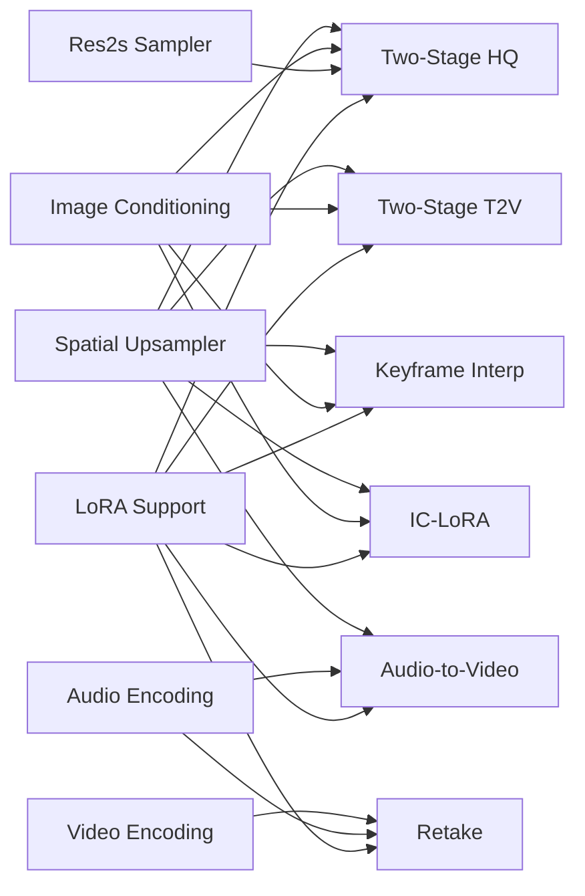

# LTX-2.3 Missing Pipelines — Implementation Plan

## Current State

### What FastVideo Has
| Pipeline | Upstream Equivalent | Status |
|----------|-------------------|--------|
| `LTX2Pipeline` + `LTX2DenoisingStage` | `TI2VidOneStagePipeline` | ✅ Working |
| `LTX23DistilledPipeline` + `LTX2DistilledDenoisingStage` | `DistilledPipeline` | ✅ Working |

### What's Missing
| Upstream Pipeline | Description | Priority |
|-------------------|-------------|----------|
| `TI2VidTwoStagesPipeline` | Two-stage T2V/I2V with CFG + distilled LoRA refinement | High |
| `TI2VidTwoStagesHQPipeline` | Two-stage HQ with Res2s sampler + distilled LoRA | High |
| `A2VidPipelineTwoStage` | Audio-to-video: freeze audio, denoise video only | Medium |
| `RetakePipeline` | Video/audio retake: re-denoise from existing video+audio | Medium |
| `KeyframeInterpolationPipeline` | Keyframe-based interpolation between images | Medium |
| `ICLoraPipeline` | In-Context LoRA for control signals (depth, pose, edges) | Low |

## Upstream Default Parameters Reference

### LTX_2_3_PARAMS (from `constants.py`)
Used by: One-Stage, Two-Stage, Keyframe Interpolation, Retake

| Parameter | Value |
|-----------|-------|
| seed | 10 |
| stage_1_height | 512 |
| stage_1_width | 768 |
| stage_2_height | 1024 |
| stage_2_width | 1536 |
| num_frames | 121 |
| frame_rate | 24.0 |
| num_inference_steps | 30 |
| **Video Guider** | |
| cfg_scale | 3.0 |
| stg_scale | 1.0 |
| rescale_scale | 0.7 |
| modality_scale | 3.0 |
| skip_step | 0 |
| stg_blocks | [28] |
| **Audio Guider** | |
| cfg_scale | 7.0 |
| stg_scale | 1.0 |
| rescale_scale | 0.7 |
| modality_scale | 3.0 |
| skip_step | 0 |
| stg_blocks | [28] |

### LTX_2_3_HQ_PARAMS (from `constants.py`)
Used by: Two-Stage HQ

| Parameter | Value |
|-----------|-------|
| num_inference_steps | 15 |
| stage_1_height | 544 (1088/2) |
| stage_1_width | 960 (1920/2) |
| stage_2_height | 1088 |
| stage_2_width | 1920 |
| **Video Guider** | |
| cfg_scale | 3.0 |
| stg_scale | 0.0 |
| rescale_scale | 0.45 |
| modality_scale | 3.0 |
| stg_blocks | [] |
| **Audio Guider** | |
| cfg_scale | 7.0 |
| stg_scale | 0.0 |
| rescale_scale | 1.0 |
| modality_scale | 3.0 |
| stg_blocks | [] |

### Sigma Schedules (from `constants.py`)
| Schedule | Values |
|----------|--------|
| DISTILLED_SIGMA_VALUES | [1.0, 0.99375, 0.9875, 0.98125, 0.975, 0.909375, 0.725, 0.421875, 0.0] |
| STAGE_2_DISTILLED_SIGMA_VALUES | [0.909375, 0.725, 0.421875, 0.0] |

### Two-Stage HQ LoRA Strengths (from `args.py`)
| Parameter | Default |
|-----------|---------|
| distilled_lora_strength_stage_1 | 0.25 |
| distilled_lora_strength_stage_2 | 0.5 |

### Pipeline-Specific Arg Parsers (from `args.py`)
| Parser | Used By | Key Additions |
|--------|---------|---------------|
| `basic_arg_parser` | All | checkpoint, gemma, prompt, seed, resolution, frames, fps, steps, images, lora, quantization |
| `default_1_stage_arg_parser` | One-Stage | + negative_prompt, all CFG/STG/modality/rescale/skip_step params |
| `default_2_stage_arg_parser` | Two-Stage, Keyframe | + distilled_lora, spatial_upsampler_path, resolution defaults to stage_2 |
| `hq_2_stage_arg_parser` | Two-Stage HQ | + distilled_lora_strength_stage_1/2 |
| `default_2_stage_distilled_arg_parser` | IC-LoRA | distilled checkpoint, spatial_upsampler_path |

## Pipeline Architecture Overview

```mermaid
graph TD
    A[User Input] --> B{Pipeline Type}
    B --> C[One-Stage T2V]
    B --> D[Two-Stage T2V]
    B --> E[Two-Stage HQ]
    B --> F[Audio-to-Video]
    B --> G[Retake]
    B --> H[Keyframe Interpolation]
    B --> I[IC-LoRA]
    
    C --> C1[30 steps + CFG/STG/Mod]
    C --> C2[Euler sampler]
    
    D --> D1[Stage 1: Half-res + CFG]
    D --> D2[2x Upsample]
    D --> D3[Stage 2: Full-res + Distilled LoRA]
    
    E --> E1[Stage 1: Half-res + Res2s sampler]
    E --> E2[2x Upsample]
    E --> E3[Stage 2: Full-res + Distilled LoRA]
    
    F --> F1[Encode input audio to latents]
    F --> F2[Stage 1: Video-only denoise]
    F --> F3[2x Upsample]
    F --> F4[Stage 2: Refine with distilled LoRA]
    
    G --> G1[Encode existing video+audio]
    G --> G2[Add noise at target sigma]
    G --> G3[Re-denoise from noised state]
    
    H --> H1[Encode keyframe images]
    H --> H2[Stage 1: Interpolate at half-res]
    H --> H3[2x Upsample]
    H --> H4[Stage 2: Refine]
    
    I --> I1[Encode control signal]
    I --> I2[Stage 1: Distilled + IC-LoRA]
    I --> I3[2x Upsample]
    I --> I4[Stage 2: Distilled refine]
```

## Pipeline 1: TI2VidTwoStagesPipeline (Two-Stage T2V/I2V)

### What It Does
- Stage 1: Generate at **half** spatial resolution with full CFG guidance (30 steps)
- Upsample: 2x spatial via `LatentUpsampler`
- Stage 2: Refine at **full** resolution with distilled LoRA (3 steps, no CFG)

### Key Differences from Distilled Pipeline
- Stage 1 uses the **full non-distilled model** with CFG/STG/modality guidance
- Stage 2 applies a **distilled LoRA** on top of the base model
- Uses `MultiModalGuiderFactory` for sigma-dependent guidance in Stage 1
- Stage 2 uses `simple_denoising_func` (no guidance)

### Implementation Steps
- [ ] Create `LTX23TwoStagePipeline` in `fastvideo/pipelines/basic/ltx2/ltx2_two_stage_pipeline.py`
- [ ] Create `LTX2TwoStageDenoisingStage` in `fastvideo/pipelines/stages/ltx2_two_stage_denoising.py`
- [ ] Add LoRA loading support for Stage 2 distilled LoRA
- [ ] Stage 1: Reuse `LTX2DenoisingStage` logic at half resolution
- [ ] Upsample: Reuse existing `LatentUpsampler`
- [ ] Stage 2: Simple denoising loop (3 steps, `STAGE_2_DISTILLED_SIGMA_VALUES`)
- [ ] Register pipeline in `fastvideo/registry.py`
- [ ] Add `LTX23TwoStageSamplingParam` config
- [ ] Test with LTX2.3-Dev model + distilled LoRA

### Required Components
- Spatial upsampler weights (already available)
- Distilled LoRA weights (need to locate/download)
- VAE `per_channel_statistics` for latent normalization

### Files to Create/Modify
| File | Action |
|------|--------|
| `fastvideo/pipelines/basic/ltx2/ltx2_two_stage_pipeline.py` | Create |
| `fastvideo/pipelines/stages/ltx2_two_stage_denoising.py` | Create |
| `fastvideo/configs/sample/ltx2.py` | Add sampling params |
| `fastvideo/registry.py` | Register pipeline |
| `fastvideo/pipelines/stages/__init__.py` | Export new stage |

## Pipeline 2: TI2VidTwoStagesHQPipeline (HQ Two-Stage with Res2s)

### What It Does
- Same two-stage structure as above but uses the **Res2s second-order sampler**
- Allows fewer steps for comparable quality (15 steps vs 30)
- Different guidance params: `rescale_scale=0.45`, `stg_scale=0.0`
- Distilled LoRA with configurable strength per stage

### Key Differences
- Uses `Res2sDiffusionStep` instead of `EulerDiffusionStep`
- `res2s_audio_video_denoising_loop` instead of `euler_denoising_loop`
- Noise injection via SDE coefficients
- Per-stage LoRA strength control

### Implementation Steps
- [ ] Implement `Res2sDiffusionStep` in `fastvideo/models/schedulers/`
- [ ] Implement `res2s_denoising_loop` sampler
- [ ] Create `LTX23HQPipeline` pipeline class
- [ ] Create `LTX2HQDenoisingStage` denoising stage
- [ ] Add per-stage LoRA strength configuration
- [ ] Register pipeline and sampling params
- [ ] Test with HQ params

### Files to Create/Modify
| File | Action |
|------|--------|
| `fastvideo/models/schedulers/res2s_step.py` | Create |
| `fastvideo/pipelines/basic/ltx2/ltx2_hq_pipeline.py` | Create |
| `fastvideo/pipelines/stages/ltx2_hq_denoising.py` | Create |
| `fastvideo/configs/sample/ltx2.py` | Add HQ sampling params |

## Pipeline 3: A2VidPipelineTwoStage (Audio-to-Video)

### What It Does
- Takes an **input audio file** and generates video synchronized to it
- Stage 1: Encode audio → freeze audio latents → denoise video only at half-res
- Upsample: 2x spatial
- Stage 2: Refine both video and audio with distilled LoRA

### Key Differences
- Audio is **encoded from input** (not generated from noise)
- Stage 1 uses `denoise_video_only` (audio `denoise_mask=0`)
- Stage 2 denoises both modalities
- Requires audio VAE encoder (not just decoder)

### Implementation Steps
- [ ] Add audio encoding support (VAE encoder for audio)
- [ ] Create `LTX23A2VPipeline` pipeline class
- [ ] Create `LTX2A2VDenoisingStage` with video-only denoising
- [ ] Add audio file loading and preprocessing
- [ ] Register pipeline
- [ ] Test with audio input files

### Files to Create/Modify
| File | Action |
|------|--------|
| `fastvideo/pipelines/basic/ltx2/ltx2_a2v_pipeline.py` | Create |
| `fastvideo/pipelines/stages/ltx2_a2v_denoising.py` | Create |
| `fastvideo/pipelines/stages/ltx2_audio_encoding.py` | Create |
| `fastvideo/models/audio/ltx2_audio_vae.py` | Add encoder support |

## Pipeline 4: RetakePipeline (Video/Audio Retake)

### What It Does
- Takes an **existing video+audio** and re-generates with modifications
- Encodes video and audio to latents
- Adds noise at a target sigma level (controls how much to change)
- Re-denoises from the noised state with new/modified prompt
- Supports both distilled (8 steps) and non-distilled (30 steps) modes

### Key Differences
- Starts from **encoded existing content** (not pure noise)
- Noise level controls edit strength (higher sigma = more change)
- Can modify prompt while preserving structure
- Supports partial retake (video only, audio only, or both)

### Implementation Steps
- [ ] Create `LTX23RetakePipeline` pipeline class
- [ ] Create `LTX2RetakeDenoisingStage`
- [ ] Add video/audio encoding stage
- [ ] Add noise injection at target sigma
- [ ] Support configurable retake strength
- [ ] Register pipeline
- [ ] Test with existing video files

### Files to Create/Modify
| File | Action |
|------|--------|
| `fastvideo/pipelines/basic/ltx2/ltx2_retake_pipeline.py` | Create |
| `fastvideo/pipelines/stages/ltx2_retake_denoising.py` | Create |
| `fastvideo/pipelines/stages/ltx2_video_encoding.py` | Create |

## Pipeline 5: KeyframeInterpolationPipeline

### What It Does
- Takes **keyframe images** at specified frame indices
- Interpolates between keyframes to generate smooth video
- Two-stage: half-res generation → upsample → full-res refinement
- Uses `image_conditionings_by_adding_guiding_latent` (not replacing)

### Key Differences
- Image conditioning uses `VideoConditionByKeyframeIndex` (guiding latent)
- All images are keyframes (not first-frame replacement)
- Stage 1 uses full CFG guidance
- Stage 2 uses distilled LoRA

### Implementation Steps
- [ ] Create `LTX23KeyframeInterpolationPipeline`
- [ ] Add keyframe conditioning support to denoising stage
- [ ] Support `VideoConditionByKeyframeIndex` conditioning type
- [ ] Register pipeline
- [ ] Test with multiple keyframe images

### Files to Create/Modify
| File | Action |
|------|--------|
| `fastvideo/pipelines/basic/ltx2/ltx2_keyframe_pipeline.py` | Create |
| `fastvideo/pipelines/stages/ltx2_keyframe_denoising.py` | Create |

## Pipeline 6: ICLoraPipeline (In-Context LoRA)

### What It Does
- Generates video conditioned on **control signals** (depth, pose, edges)
- Uses IC-LoRA weights for the specific control type
- Two-stage distilled pipeline
- Supports `VideoConditionByReferenceLatent` for control conditioning

### Key Differences
- Requires IC-LoRA weights specific to control type
- Uses `ConditioningItemAttentionStrengthWrapper` for attention-based conditioning
- Both stages use distilled model
- Control signal encoded via VAE

### Implementation Steps
- [ ] Create `LTX23ICLoraPipeline`
- [ ] Add `VideoConditionByReferenceLatent` support
- [ ] Add attention strength wrapper for conditioning
- [ ] Support IC-LoRA weight loading
- [ ] Register pipeline
- [ ] Test with depth/pose control signals

### Files to Create/Modify
| File | Action |
|------|--------|
| `fastvideo/pipelines/basic/ltx2/ltx2_ic_lora_pipeline.py` | Create |
| `fastvideo/pipelines/stages/ltx2_ic_lora_denoising.py` | Create |

## Shared Components Needed

### LoRA Support
All two-stage pipelines (except distilled) need LoRA loading for Stage 2.
The upstream uses `ModelLedger.with_additional_loras()` to create a
second model ledger with the distilled LoRA applied.

FastVideo needs:
- [ ] LoRA weight loading for LTX-2.3 transformer
- [ ] Per-stage LoRA application/removal
- [ ] LoRA strength configuration

### Res2s Sampler
The HQ pipeline uses a second-order sampler with SDE noise injection.

FastVideo needs:
- [ ] `Res2sDiffusionStep` implementation
- [ ] `res2s_denoising_loop` with noise injection

### Video/Audio Encoding
Retake and A2V pipelines need to encode existing content to latents.

FastVideo needs:
- [ ] Video encoding via VAE encoder
- [ ] Audio encoding via audio VAE encoder
- [ ] Video file loading and preprocessing

### Image Conditioning
Multiple pipelines support image conditioning (I2V, keyframe, IC-LoRA).

FastVideo needs:
- [ ] `VideoConditionByLatentIndex` — replace latent at frame index
- [ ] `VideoConditionByKeyframeIndex` — guide with keyframe latent
- [ ] `VideoConditionByReferenceLatent` — reference-based conditioning
- [ ] Image loading, resizing, and VAE encoding

## Recommended Implementation Order

1. **Two-Stage T2V** — highest value, reuses most existing code
2. **Two-Stage HQ** — adds Res2s sampler, builds on Two-Stage T2V
3. **Audio-to-Video** — unique capability, needs audio encoding
4. **Retake** — editing capability, needs video/audio encoding
5. **Keyframe Interpolation** — creative tool, needs image conditioning
6. **IC-LoRA** — specialized, needs IC-LoRA weights and reference conditioning

## Dependencies

