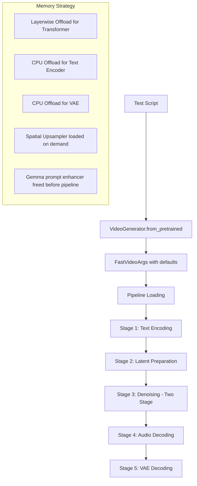
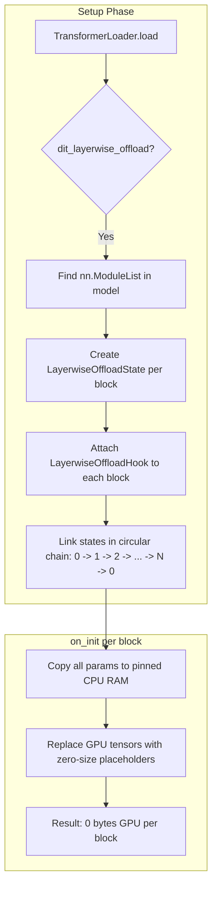
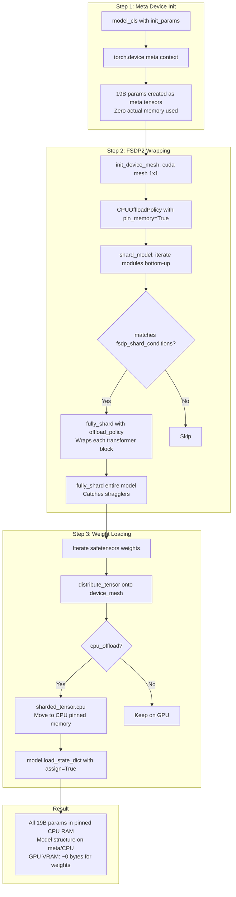
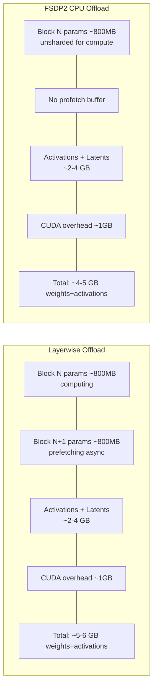
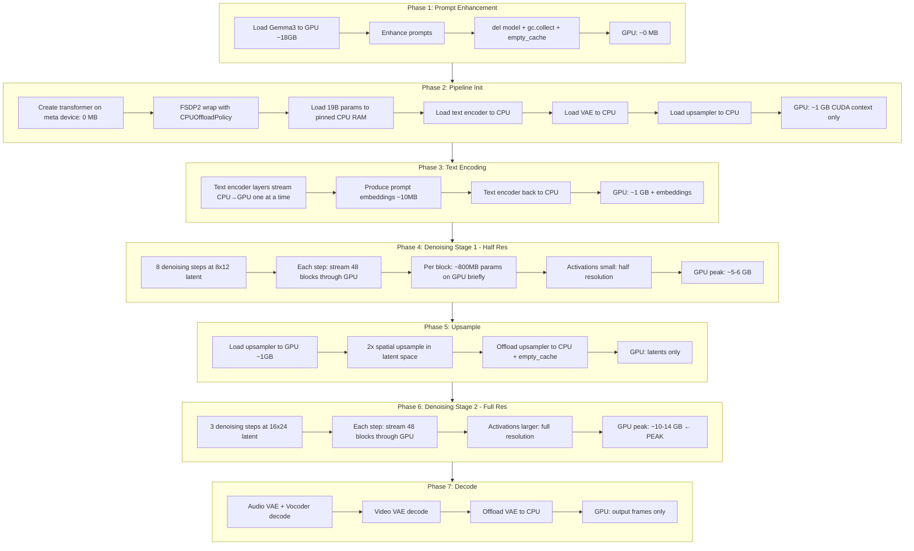

# How LTX-2.3 Runs on a Single GPU: Memory Management Deep Dive

## The Puzzle

The LTX-2.3 Distilled model has **18.99B parameters** (transformer alone). At bf16, that's ~38 GB just for the transformer weights. Add the text encoder (Gemma-based, ~9B params = ~18 GB), VAE, audio VAE, vocoder, spatial upsampler, and activations — the total model footprint far exceeds any single GPU's VRAM.

Yet the test runs successfully on **1 GPU with only 14,027 MB (~14 GB) peak VRAM**:

```
✅ singer_spotlight: 55.6s, 14027 MB
```

How? The answer is a **multi-layered CPU offloading strategy** where only a fraction of the model is on GPU at any given time.

---

## Architecture Overview



---

## The Two CPU Offloading Mechanisms: Layerwise vs FSDP2

FastVideo has **two distinct mechanisms** for keeping the transformer's weights off GPU. They are **mutually exclusive** — you use one or the other, never both. The [`check_fastvideo_args()`](fastvideo/fastvideo_args.py:665) method enforces this:

```python
if self.dit_layerwise_offload:
    if self.use_fsdp_inference:
        self.use_fsdp_inference = False   # auto-disable FSDP
    if self.dit_cpu_offload:
        self.dit_cpu_offload = False      # auto-disable bulk offload
```

### Which one is used in this test?

The test script passes:
```python
generator = VideoGenerator.from_pretrained(
    model_path,
    num_gpus=1, tp_size=1, sp_size=1,
    use_fsdp_inference=True,       # explicitly enabled
    dit_layerwise_offload=False,   # explicitly disabled
)
```

Since `dit_layerwise_offload=False`, the validation does NOT override `use_fsdp_inference`. So this test uses **FSDP2 CPU offloading**, not layerwise offloading. But both achieve the same goal — let me explain each in detail.

---

## Mechanism 1: `dit_layerwise_offload` — FastVideo's Custom Hook-Based Offloading

**Files:** [`layerwise_offload.py`](fastvideo/hooks/layerwise_offload.py), [`hooks.py`](fastvideo/hooks/hooks.py)

**Default:** `True` (this is the default for most users)

This is FastVideo's own implementation, independent of PyTorch's FSDP. It works by attaching pre/post forward hooks to each transformer block (layer) in the model's `nn.ModuleList`.

### Visual Flow: Layerwise Offload Setup



### Visual Flow: Layerwise Offload Runtime — One Denoising Step

```mermaid
sequenceDiagram
    participant CPU as CPU RAM<br/>Pinned Memory
    participant Async as Async CUDA Stream<br/>DMA Copy Engine
    participant GPU as GPU VRAM
    participant Comp as Compute Stream<br/>GPU SMs

    rect rgb(40, 40, 80)
    Note over CPU,Comp: === Block 0 Forward ===
    end

    CPU->>GPU: wait_and_replace_params: Block 0 params CPU→GPU<br/>blocking copy, first time only
    Note over GPU: Block 0 params now on GPU ~800MB

    CPU->>Async: prefetch_params: Block 1 params CPU→GPU<br/>non_blocking=True, async DMA
    Note over Async: Copying Block 1 in background...

    Comp->>Comp: Block 0 forward computation<br/>attention + FFN + norms

    Note over GPU: post_forward: release Block 0 params<br/>replace with zero-size placeholders
    GPU-->>GPU: Free ~800MB

    rect rgb(40, 80, 40)
    Note over CPU,Comp: === Block 1 Forward ===
    end

    Comp->>Async: wait_and_replace_params: sync async stream
    Note over GPU: Block 1 params already on GPU from prefetch

    CPU->>Async: prefetch_params: Block 2 params CPU→GPU<br/>non_blocking=True, async DMA
    Note over Async: Copying Block 2 in background...

    Comp->>Comp: Block 1 forward computation

    Note over GPU: post_forward: release Block 1 params
    GPU-->>GPU: Free ~800MB

    rect rgb(80, 40, 40)
    Note over CPU,Comp: === Block 2 Forward ===
    end

    Note over CPU,Comp: ... pattern repeats for all 48 blocks ...

    rect rgb(80, 80, 40)
    Note over CPU,Comp: === Block 47 - Last Block ===
    end

    Comp->>Async: wait_and_replace_params: sync
    CPU->>Async: prefetch_params: Block 0 - circular link<br/>ready for next denoising step
    Comp->>Comp: Block 47 forward computation
    Note over GPU: post_forward: release Block 47 params
```



### How it's set up

When the transformer is loaded in [`TransformerLoader.load()`](fastvideo/models/loader/component_loader.py:878):

```python
if fastvideo_args.inference_mode and fastvideo_args.dit_layerwise_offload:
    has_module_list = any(
        isinstance(m, nn.ModuleList) for m in model.children()
    )
    if has_module_list:
        enable_layerwise_offload(model)
```

The [`enable_layerwise_offload()`](fastvideo/hooks/layerwise_offload.py:131) function does the following:

1. **Finds the `nn.ModuleList`** — this is the list of transformer blocks (e.g., 48 blocks for LTX-2.3)
2. **Creates a `LayerwiseOffloadState` for each block** — each state manages that block's CPU↔GPU parameter transfers
3. **Attaches a `LayerwiseOffloadHook` to each block** — this hook intercepts the block's `forward()` call
4. **Links states in a circular chain** — so each block knows about the *next* block for prefetching

### The initialization: moving weights to CPU

When the hook is attached, [`on_init()`](fastvideo/hooks/layerwise_offload.py:37) runs:

```python
def on_init(self, module: nn.Module):
    self.module_ref = module
    for name, param in self.module_ref.named_parameters():
        if self._will_offload(name):
            # Copy parameter to CPU with pinned memory
            self.cpu_named_parameters[name] = (
                param.data.detach().to("cpu").pin_memory())
            # Replace GPU tensor with a zero-size placeholder
            param.data = _tensor_placeholder(param.data, self.device)
```

This is the key trick: every parameter in the block is:
- **Copied to pinned CPU RAM** (pinned memory enables fast async DMA transfers)
- **Replaced with a zero-size placeholder tensor** on GPU (essentially freeing all GPU memory for that block)

After initialization, the entire transformer's weights are on CPU. GPU holds only tiny placeholder tensors.

### The forward pass: streaming one layer at a time

When the transformer runs a forward pass, it iterates through its blocks. For each block, the [`ModuleHookManager`](fastvideo/hooks/hooks.py:43) intercepts the call:

```python
def forward_hook_wrapper(mod, *args, **kwargs):
    manager = getattr(mod, cls.module_hook_attribute)
    for hook in manager.forward_hooks.values():
        args, kwargs = hook.pre_forward(mod, *args, **kwargs)   # ← load params
    output = manager.original_forward(*args, **kwargs)           # ← compute
    for hook in reversed(manager.forward_hooks.values()):
        output = hook.post_forward(mod, output)                  # ← free params
    return output
```

**`pre_forward`** — [`LayerwiseOffloadHook.pre_forward()`](fastvideo/hooks/layerwise_offload.py:108):
```python
def pre_forward(self, module, *args, **kwargs):
    # 1. Wait for THIS layer's params to arrive on GPU
    self.state.wait_and_replace_params()
    # 2. Start async prefetch of NEXT layer's params
    if self.state.next_state is not None:
        self.state.next_state.prefetch_params()
    return args, kwargs
```

**`post_forward`** — [`LayerwiseOffloadHook.post_forward()`](fastvideo/hooks/layerwise_offload.py:114):
```python
def post_forward(self, module, output):
    # Free this layer's GPU params (replace with placeholders)
    self.state.release_gpu_params()
    return output
```

### The async prefetch details

[`prefetch_params()`](fastvideo/hooks/layerwise_offload.py:59) uses a dedicated CUDA stream for async copies:

```python
def prefetch_params(self):
    compute_stream = torch.cuda.current_stream()
    with torch.cuda.stream(self.async_copy_stream):
        for name, param in self.module_ref.named_parameters():
            # Non-blocking copy from pinned CPU → GPU
            gpu_param = self.cpu_named_parameters[name].to(
                self.device, non_blocking=True)
            # Prevent premature deallocation
            gpu_param.record_stream(compute_stream)
            self.gpu_named_parameters[name] = gpu_param
```

[`wait_and_replace_params()`](fastvideo/hooks/layerwise_offload.py:46) synchronizes before the forward:

```python
def wait_and_replace_params(self):
    # Wait for async copy to complete
    torch.cuda.current_stream().wait_stream(self.async_copy_stream)
    # Swap placeholder tensors with real GPU tensors
    for name, param in self.module_ref.named_parameters():
        if name not in self.gpu_named_parameters:
            # First time: blocking copy
            self.gpu_named_parameters[name] = (
                self.cpu_named_parameters[name].to(self.device))
        param.data = self.gpu_named_parameters[name]
```

[`release_gpu_params()`](fastvideo/hooks/layerwise_offload.py:74) frees GPU memory after the forward:

```python
def release_gpu_params(self):
    for name, param in self.module_ref.named_parameters():
        if self._will_offload(name):
            param.data = _tensor_placeholder(param.data, self.device)
            del self.gpu_named_parameters[name]
```

### Memory profile with layerwise offload

At any moment during denoising, GPU holds:
- **1 transformer block's parameters** (~400M params × 2 bytes = ~800 MB)
- **1 transformer block's parameters being prefetched** (overlapping, ~800 MB)
- **Activations** for the current computation
- **Latent tensors** and **prompt embeddings**

So instead of 38 GB for the full transformer, you need ~1.6 GB for weights + activations.

---

## Mechanism 2: `use_fsdp_inference` + `dit_cpu_offload` — PyTorch FSDP2 CPU Offloading

**File:** [`fsdp_load.py`](fastvideo/models/loader/fsdp_load.py)

**This is what the test actually uses** (since it passes `use_fsdp_inference=True, dit_layerwise_offload=False`).

FSDP2 (Fully Sharded Data Parallel v2) is PyTorch's native distributed training/inference framework. FastVideo repurposes it for **CPU offloading on a single GPU**.

### Visual Flow: FSDP2 Setup



### Visual Flow: FSDP2 Runtime — One Denoising Step

```mermaid
sequenceDiagram
    participant CPU as CPU RAM<br/>Pinned Memory
    participant FSDP as FSDP2 Runtime<br/>PyTorch Internal
    participant GPU as GPU VRAM
    participant Comp as GPU Compute

    rect rgb(40, 40, 80)
    Note over CPU,Comp: === Transformer Block 0 ===
    end

    Note over FSDP: fully_shard pre-forward hook triggers
    FSDP->>GPU: Unshard: copy Block 0 params CPU→GPU<br/>PyTorch manages transfer internally
    Note over GPU: Block 0 params materialized ~800MB

    Comp->>Comp: Block 0 forward: attention + FFN

    Note over FSDP: reshard_after_forward=True triggers
    FSDP->>CPU: Reshard: move Block 0 params GPU→CPU
    Note over GPU: Block 0 params freed

    rect rgb(40, 80, 40)
    Note over CPU,Comp: === Transformer Block 1 ===
    end

    FSDP->>GPU: Unshard: copy Block 1 params CPU→GPU
    Comp->>Comp: Block 1 forward: attention + FFN
    FSDP->>CPU: Reshard: move Block 1 params GPU→CPU

    rect rgb(80, 40, 40)
    Note over CPU,Comp: === Transformer Block 2 ===
    end

    Note over CPU,Comp: ... pattern repeats for all 48 blocks ...

    rect rgb(80, 80, 40)
    Note over CPU,Comp: === Block 47 - Last Block ===
    end

    FSDP->>GPU: Unshard: copy Block 47 params CPU→GPU
    Comp->>Comp: Block 47 forward
    FSDP->>CPU: Reshard: move Block 47 params GPU→CPU

    Note over GPU: Transformer forward complete<br/>GPU holds only activations + latents
```



### How it's set up

In [`maybe_load_fsdp_model()`](fastvideo/models/loader/fsdp_load.py:60):

**Step 1 — Create model on meta device (zero memory):**
```python
with set_default_dtype(default_dtype), torch.device("meta"):
    model = model_cls(**init_params)
```

The `torch.device("meta")` context means all tensors are created as "meta tensors" — they have shape and dtype but **no actual storage**. This lets you instantiate a 19B-parameter model using essentially zero memory.

**Step 2 — Configure FSDP2 with CPU offload:**
```python
use_fsdp = training_mode or fsdp_inference  # True in our case

if use_fsdp:
    device_mesh = init_device_mesh(
        "cuda",
        mesh_shape=(hsdp_replicate_dim, hsdp_shard_dim),  # (1, 1) for single GPU
        mesh_dim_names=("replicate", "shard"),
    )
    
    fsdp_kwargs = {
        "reshard_after_forward": True,  # key: free params after each module
        "mp_policy": mp_policy,
    }
    if cpu_offload:
        fsdp_kwargs["offload_policy"] = CPUOffloadPolicy(pin_memory=True)
    
    shard_model(model, cpu_offload=True, **fsdp_kwargs)
```

**Step 3 — The [`shard_model()`](fastvideo/models/loader/fsdp_load.py:168) function wraps each transformer block:**

```python
def shard_model(model, *, cpu_offload, reshard_after_forward, ...):
    # Bottom-up: wrap each module that matches shard conditions
    for n, m in reversed(list(model.named_modules())):
        if any(cond(n, m) for cond in fsdp_shard_conditions):
            fully_shard(m, **fsdp_kwargs)  # PyTorch's FSDP2 API
            num_layers_sharded += 1
    
    # Finally wrap the entire model
    fully_shard(model, **fsdp_kwargs)
```

Each transformer block gets wrapped with `fully_shard()`, which tells PyTorch to manage that module's parameters using FSDP2.

**Step 4 — Load weights into the sharded model:**

```python
for target_param_name, full_tensor in custom_param_sd.items():
    full_tensor = full_tensor.to(device=device, dtype=param_dtype)
    sharded_tensor = distribute_tensor(
        full_tensor,
        meta_sharded_param.device_mesh,
        meta_sharded_param.placements,
    )
    if cpu_offload:
        sharded_tensor = sharded_tensor.cpu()  # Move to CPU!
    sharded_sd[target_param_name] = nn.Parameter(sharded_tensor)
```

After loading, all parameters are on **CPU** (pinned memory).

### How FSDP2 CPU offload works at runtime

PyTorch's FSDP2 with `CPUOffloadPolicy` and `reshard_after_forward=True` works similarly to the layerwise approach but is managed by PyTorch internally:

1. **Before a wrapped module's forward:** FSDP2 automatically copies that module's parameters from CPU → GPU (unshard)
2. **During forward:** Computation happens on GPU with the parameters present
3. **After forward (`reshard_after_forward=True`):** FSDP2 moves parameters back to CPU and frees GPU memory (reshard)

### Why use FSDP2 over layerwise?

The test uses `use_fsdp_inference=True` because:
- FSDP2 is more battle-tested for distributed scenarios
- It integrates with PyTorch's mixed precision policy (`MixedPrecisionPolicy`)
- It handles edge cases around gradient management, parameter placement, etc.
- When scaling to multi-GPU, FSDP2 can shard parameters across GPUs (not just offload to CPU)

---

## Comparison: Layerwise Offload vs FSDP2 CPU Offload

| Aspect | `dit_layerwise_offload` | `use_fsdp_inference` + `dit_cpu_offload` |
|--------|------------------------|------------------------------------------|
| **Implementation** | FastVideo custom hooks | PyTorch FSDP2 native |
| **Granularity** | Per transformer block in ModuleList | Per FSDP-wrapped module |
| **Async prefetch** | Explicit: dedicated CUDA stream, prefetches next block during current compute | Managed by PyTorch internally |
| **Pinned memory** | Manual `.pin_memory()` on each param | Via `CPUOffloadPolicy pin_memory=True` |
| **Multi-GPU** | No sharding, just offload | Can shard across GPUs too |
| **Default** | `True` - default for users | `False` - opt-in |
| **GPU memory at peak** | ~2 blocks: current + prefetched ~1.6 GB | ~1 block: current only ~800 MB |
| **Placeholder trick** | Zero-size tensors on GPU | FSDP2 internal DTensor management |
| **Compute/transfer overlap** | Yes - explicit pipeline | Depends on PyTorch version |

### Visual: Side-by-Side GPU Memory During One Denoising Step



---

## Other Memory Tricks in the Pipeline

### 3. Sequential Component Lifecycle — Gemma Prompt Enhancer

**File:** [`test_ltx2_audio_quality.py`](tests/helix/test_ltx2_audio_quality.py:266)

The test script uses `--enhance-prompt`, which loads the full Gemma3 model (~9B params) to enhance prompts **before** the video pipeline loads:

```python
# Load Gemma, enhance all prompts
_model = _G3.from_pretrained(...).to("cuda").eval()
# ... enhance prompts ...

# Free Gemma BEFORE loading video pipeline
del _model, _tokenizer
gc.collect()
torch.cuda.empty_cache()
```

### 4. Text Encoder CPU Offloading via FSDP2

**File:** [`component_loader.py`](fastvideo/models/loader/component_loader.py:338)

The text encoder (LTX2GemmaTextEncoderModel) is loaded with CPU offloading by default (`text_encoder_cpu_offload=True`):

```python
use_cpu_offload = (
    fastvideo_args.text_encoder_cpu_offload  # True by default
    and len(getattr(model_config, "_fsdp_shard_conditions", [])) > 0
)

if fastvideo_args.text_encoder_cpu_offload:
    target_device = torch.device("cpu")  # Load to CPU initially
```

### 5. VAE and Spatial Upsampler — On-Demand Loading

**VAE** — [`decoding.py`](fastvideo/pipelines/stages/decoding.py:270):
```python
if fastvideo_args.vae_cpu_offload:
    self.vae.to("cpu")
```

**Spatial Upsampler** — [`ltx2_distilled_denoising.py`](fastvideo/pipelines/stages/ltx2_distilled_denoising.py:558):
```python
# Move upsampler to GPU for the upsample step (~1 GB)
self.spatial_upsampler.to(device)

# ... do upsampling ...

# Offload upsampler back to CPU to free VRAM for stage 2
self.spatial_upsampler.to("cpu")
torch.cuda.empty_cache()
```

---

## Full Pipeline Visual Flow: GPU Memory Over Time



---

## Timeline: What's on GPU When?

```mermaid
gantt
    title GPU VRAM Usage Timeline
    dateFormat X
    axisFormat %s

    section Prompt Enhancement
    Gemma3 model ~18GB     :a1, 0, 15
    Free Gemma             :milestone, 15, 0

    section Pipeline Loading
    Meta device init       :a2, 15, 20
    FSDP wrap - weights to CPU :a3, 20, 55

    section Text Encoding
    Text encoder layers stream CPU to GPU :a4, 55, 65

    section Denoising Stage 1 - Half Res
    Transformer layers stream 1-at-a-time :a5, 65, 85

    section Upsampling
    Upsampler on GPU ~1GB  :a6, 85, 87
    Free upsampler         :milestone, 87, 0

    section Denoising Stage 2 - Full Res
    Transformer layers stream 1-at-a-time :a7, 87, 100

    section Decoding
    VAE on GPU             :a8, 100, 110
    Free VAE               :milestone, 110, 0
```



---

## The Two-Stage Pipeline Reduces Activation Memory

**File:** [`ltx2_distilled_denoising.py`](fastvideo/pipelines/stages/ltx2_distilled_denoising.py:461)

The `LTX2_TWO_STAGE=1` environment variable enables a two-stage approach that also reduces peak activation memory:

1. **Stage 1**: Denoise at **half spatial resolution** (8×12 latent grid) for 8 steps
   - Activations are 4× smaller than full resolution
   - Attention memory is 16× smaller (quadratic in sequence length)

2. **Upsample**: 2× spatial upsampling in latent space via `LatentUpsampler`
   - Upsampler loaded to GPU, used, then offloaded back to CPU

3. **Stage 2**: Refine at **full resolution** (16×24 latent grid) for only 3 steps
   - Fewer steps = less total compute, though each step uses more memory

---

## Memory Budget Breakdown (Estimated)

| Component | Total Size bf16 | On GPU at peak | Mechanism |
|-----------|----------------|----------------|-----------|
| Transformer - 19B params | ~38 GB | ~800 MB - 1 layer | FSDP2 CPU offload |
| Text Encoder ~9B params | ~18 GB | ~400 MB - 1 layer | FSDP2 CPU offload |
| VAE | ~200 MB | Only during decode | `vae_cpu_offload` |
| Audio VAE + Vocoder | ~50 MB | Only during audio decode | Small enough to fit |
| Spatial Upsampler - 498M params | ~1 GB | Only during upsample | Manual `.to()` |
| Latents -
