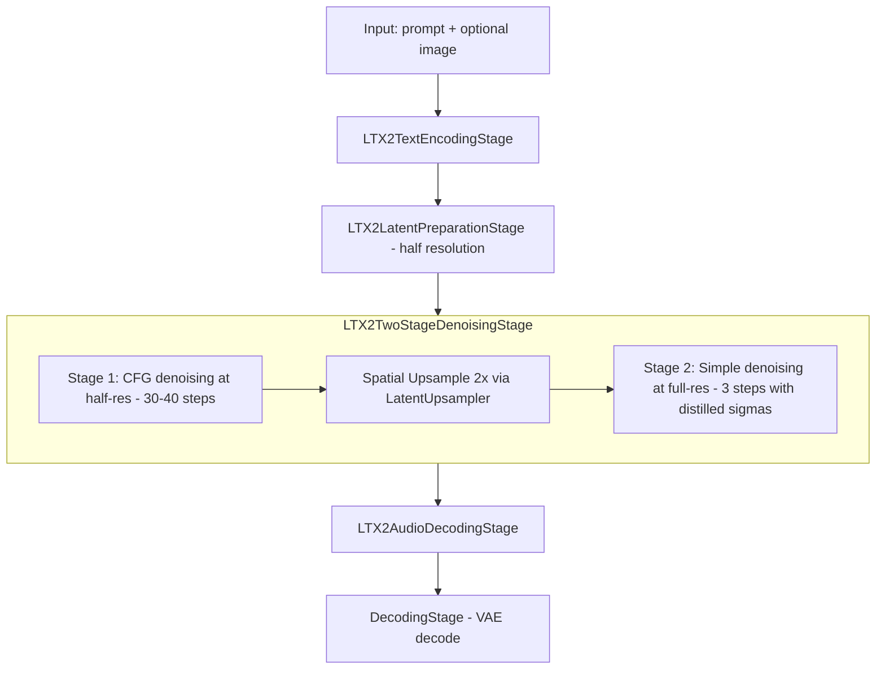

# LTX-2.3 TI2Vid Two-Stage Pipeline Implementation Plan

## Summary

Implement the **TI2VidTwoStagesPipeline** from the LTX-2 reference repo into FastVideo's stage-based architecture. This is the **production-quality** pipeline that generates video at half resolution with CFG guidance, then upsamples 2× and refines with distilled sigma schedule.

## Answer: Skip TI2VidOneStagePipeline, Go Straight to TI2VidTwoStagesPipeline

**Reasoning:**
- `TI2VidOneStagePipeline` is functionally equivalent to the existing `LTX2Pipeline` + `LTX2DenoisingStage` — single-pass denoising with CFG/STG/modality guidance at target resolution. The README explicitly says it is *"primarily for educational purposes"*.
- `TI2VidTwoStagesPipeline` is the **recommended production pipeline** and the only one worth implementing.
- The existing `LTX2DistilledDenoisingStage` already implements the distilled two-stage flow (no guidance). What is missing is the **guided** two-stage flow where Stage 1 uses full CFG/STG and Stage 2 uses distilled LoRA refinement.

## Architecture Overview



## What Exists vs What Needs to Be Built

### Already Exists in FastVideo
| Component | File | Purpose |
|-----------|------|---------|
| `LTX2DenoisingStage` | `stages/ltx2_denoising.py` | Full CFG/STG/modality denoising loop |
| `LTX2DistilledDenoisingStage` | `stages/ltx2_distilled_denoising.py` | Distilled two-stage with no guidance |
| `LTX2LatentPreparationStage` | `stages/ltx2_latent_preparation.py` | Latent noise initialization |
| `LTX2TextEncodingStage` | `stages/ltx2_text_encoding.py` | Gemma text encoding |
| `LTX2AudioDecodingStage` | `stages/ltx2_audio_decoding.py` | Audio VAE + vocoder decoding |
| `DecodingStage` | `stages/decoding.py` | Video VAE decoding |
| `LatentUpsampler` | `models/upsamplers/latent_upsampler.py` | 2x spatial upsampling |
| `LTX23DistilledPipeline` | `basic/ltx2/ltx2_distilled_pipeline.py` | Distilled pipeline orchestration |
| `LTX2Pipeline` | `basic/ltx2/ltx2_pipeline.py` | One-stage pipeline orchestration |

### Needs to Be Built
| Component | File | Purpose |
|-----------|------|---------|
| `LTX2TwoStageDenoisingStage` | `stages/ltx2_two_stage_denoising.py` | **New** - Combines CFG stage 1 + upsample + distilled stage 2 |
| `LTX23TwoStagePipeline` | `basic/ltx2/ltx2_two_stage_pipeline.py` | **New** - Pipeline orchestration for two-stage |
| `LTX23TwoStageSamplingParam` | `configs/sample/ltx2.py` | **New** - Sampling params for two-stage |

## Detailed Design

### 1. `LTX2TwoStageDenoisingStage` - The Core New Stage

This is the key new component. It combines the logic from:
- Stage 1: `LTX2DenoisingStage` CFG loop at half resolution
- Upsample: `LatentUpsampler` 2x spatial
- Stage 2: Simple Euler denoising with `STAGE_2_DISTILLED_SIGMA_VALUES`

**Key design decisions:**
- Reuse the CFG/STG/modality guidance logic from `LTX2DenoisingStage._denoise_loop_with_guidance` for Stage 1
- Reuse the simple denoising loop from `LTX2DistilledDenoisingStage._denoise_loop` for Stage 2
- The stage manages the half-res → full-res transition internally
- Audio latents are initialized once and carried through both stages

**Stage 1 flow** - matches `TI2VidTwoStagesPipeline.__call__` lines 117-173:
1. Create half-res latents: `[B, C, F, H//2, W//2]`
2. Initialize audio latents
3. Run sigma schedule from `LTX2Scheduler` with `num_inference_steps` steps
4. Denoise with full CFG/STG/modality guidance using `multi_modal_guider_factory_denoising_func` equivalent

**Upsample** - matches lines 180-198:
1. Load spatial upsampler to GPU
2. `upsample_video_latent` on the stage 1 output
3. Offload upsampler back to CPU

**Stage 2 flow** - matches lines 200-232:
1. Noise the upsampled latent to `STAGE_2_DISTILLED_SIGMA_VALUES[0]`
2. Run simple Euler denoising with no guidance, 3 steps
3. Use stage 1 audio latent as initial audio for stage 2

### 2. `LTX23TwoStagePipeline` - Pipeline Orchestration

Follows the same pattern as `LTX23DistilledPipeline` but uses `LTX2TwoStageDenoisingStage`:

```
Stages:
  1. InputValidationStage
  2. LTX2TextEncodingStage  (encodes both positive + negative prompts)
  3. LTX2LatentPreparationStage  (prepares latents at HALF resolution)
  4. LTX2TwoStageDenoisingStage  (stage 1 CFG + upsample + stage 2 distilled)
  5. LTX2AudioDecodingStage
  6. DecodingStage
```

**Module requirements:**
- `text_encoder`, `tokenizer` - Gemma
- `transformer` - LTX2Transformer3DModel
- `vae` - CausalVideoAutoencoder
- `audio_vae` - LTX2AudioDecoder
- `vocoder` - LTX2Vocoder
- Spatial upsampler - loaded from known paths like in `LTX23DistilledPipeline`

### 3. `LTX23TwoStageSamplingParam` - Sampling Configuration

Based on `LTX_2_3_PARAMS` from the reference constants:
- `num_inference_steps`: 30 for stage 1
- `height`/`width`: Target full resolution (e.g., 1024x1536) - the stage internally halves for stage 1
- CFG defaults: `cfg_scale_video=3.0`, `cfg_scale_audio=7.0`
- STG defaults: `stg_scale=1.0`, `stg_blocks=[28]` for LTX-2.3
- Modality: `modality_scale=3.0`
- Rescale: `0.7`

### 4. Pipeline Registration

The pipeline auto-discovers via `EntryClass` in the module. Set:
```python
EntryClass = LTX23TwoStagePipeline
```

The `model_index.json` `_class_name` field maps to the pipeline. Since the nvfp4 model uses `_class_name: "LTX2Pipeline"`, we may need to either:
- Add a new `_class_name` mapping, OR
- Use an environment variable or CLI flag to select two-stage mode

## Key Differences from Existing Distilled Pipeline

| Aspect | LTX23DistilledPipeline | LTX23TwoStagePipeline - new |
|--------|----------------------|---------------------------|
| Stage 1 guidance | None - single forward pass | Full CFG + STG + modality - up to 4 forward passes per step |
| Stage 1 sigmas | Fixed distilled schedule - 8 steps | Computed via LTX2Scheduler - 30 steps |
| Stage 1 resolution | Half-res | Half-res |
| Stage 2 guidance | None | None |
| Stage 2 sigmas | `STAGE_2_DISTILLED_SIGMA_VALUES` - 3 steps | `STAGE_2_DISTILLED_SIGMA_VALUES` - 3 steps |
| Negative prompt | Not used | Required for CFG |
| Quality | Good - fast | Best - production recommended |
| Speed | Fast - ~11 total steps | Slower - ~33 total steps |

## File Changes Summary

1. **New file**: `fastvideo/pipelines/stages/ltx2_two_stage_denoising.py`
   - `LTX2TwoStageDenoisingStage` class

2. **New file**: `fastvideo/pipelines/basic/ltx2/ltx2_two_stage_pipeline.py`
   - `LTX23TwoStagePipeline` class
   - `EntryClass = LTX23TwoStagePipeline`

3. **Modified**: `fastvideo/pipelines/stages/__init__.py`
   - Add import and export of `LTX2TwoStageDenoisingStage`

4. **Modified**: `fastvideo/configs/sample/ltx2.py`
   - Add `LTX23TwoStageSamplingParam` dataclass

5. **Possibly modified**: `fastvideo/configs/models/dits/ltx2.py`
   - May need a new config variant for two-stage pipeline selection
